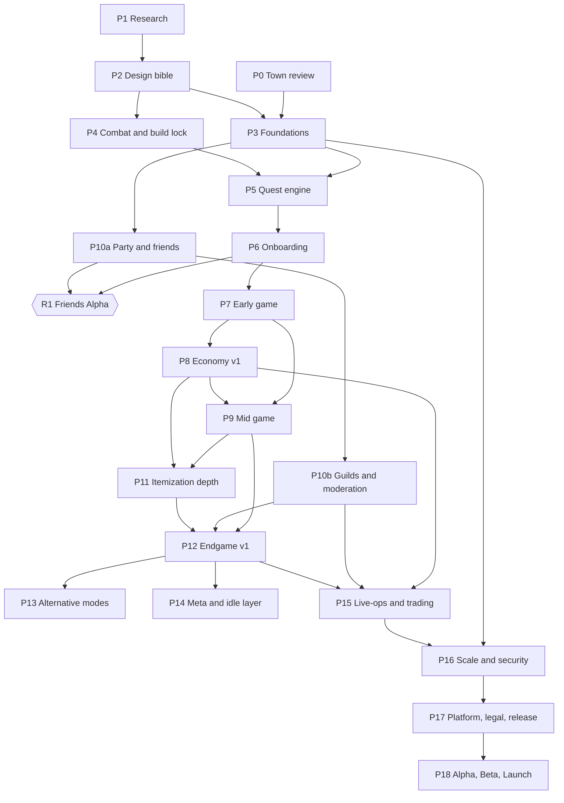

# Hearthfall — Full-Game Roadmap

**From a playable, researched prototype to a shippable online action-RPG: order of work, gates, research program, leveling direction, features, UI, combat options, and how to use Codex.**

| | |
|---|---|
| Status | **DRAFT v1 for owner review.** Nothing here is approved until the owner says so. |
| Written | 2026-10-08, by Claude (Sonnet 5.5) |
| Measured against | commit `d630a76` on `codex/new-tristram-town`. The gameplay data files (`shared/src/data/*`, `progression.ts`, `items.ts`, `cube.ts`) are unchanged since baseline `794f77e`. |
| Reproduce every `[M]` number | `npx tsx docs/design/baseline-audit.ts` from the repo root (saved output: `docs/design/baseline-audit.output.txt`) |
| Audience | the owner (they/them) · Codex (the owner calls it "astra 6") · any future agent |
| How big | Large on purpose. Sections are self-contained; §0.4 says what to read when. |

---

## Table of contents

- **0. Read this first** — 60-second version · evidence labels · inherited rules · reading order
- **1. Where the game is today (measured)** — snapshot · pacing tables · gap list · old research vs. code · velocity
- **2. The plan in one page** — ordering principles · phase map · release ladder · what we do *not* build yet
- **3. Working with Codex** — honest capability assessment · capability-fit per phase · work protocol · gates · reporting
- **4. Phase 1 — Research program** — rules · templates · 20 research charters · cross-game matrices · exit gate
- **5. Phase 2 — Design bible & decision register** — 40 owner decisions with options and evidence required
- **6. The leveling direction** — diagnosis · five-movement journey · unlock ladder · pacing-target method
- **7. Implementation phases 3–18** — each with goal, why now, scope, out of scope, acceptance, verification, gate, risks, rollback
- **8. Feature catalogue** — every feature, status, phase
- **9. UI atlas** — every screen, status, phase · HUD rules · UX principles
- **10. Combat depth and alternative ways to fight** — option menu with recommendations
- **11. Content budgets and production pipeline**
- **12. Cross-cutting checklists** — quality · performance · security · legal/IP · accessibility · localization
- **13. Risk register**
- **14. Open questions for the owner (prioritised)**
- **Appendices** — A paste-in prompts for Codex · B glossary & naming policy · C repo map · D dossier audit · E source-hunting guide · F templates

---

## 0. Read this first

### 0.1 The 60-second version

1. **Where we are.** A playable vertical slice: 3 classes, 18 auto-cast skills with runes and tiers, Diablo-3-style loot (ancients, legendaries, a set per class), a Cube with 8 crafting functions, levels 1–70 plus Paragon, 14 difficulty tiers, instanced rifts, multiplayer channels, offline gains, and a newly authored town (Hearthmere) waiting for your review. `[M]`
2. **What is not there yet** (and an MMO needs): accounts — today *anyone who types a character's name logs into that character*; a tutorial; quests; vendors; party/friends/guild/trade; settings and key bindings; a map screen; moderation tools; and most of the content — two flat fields, ten trash monsters for all 70 levels, two bosses. `[M]`
3. **The old research cannot be used as facts.** `docs/research/` holds 21 dossiers that were added in a single commit on 2026-10-04. Seven contain *no source URL at all*, and the synthesis disagrees with the shipped code or the owner's recorded decisions in 17 places, 11 of them direct contradictions of measured code (tick rate, engine, number of rarities, XP, skill unlocks, class resources…). See §1.5. Phase 1 therefore redoes research with the evidence standard Codex already used for the town.
4. **The order** (§2): Evidence → Decisions → Foundations (accounts, saves, content pipeline, settings, tests) → Combat/build lock → Quest engine → Onboarding → Early game → Economy → Mid game → Social → Itemization depth → Endgame → optional modes / meta layer → live-ops → scale and security → platforms → launch operations. Reasons in §2.1.
5. **Leveling direction** (§6). Today the curve is *vertical only*: numbers grow, novelty does not (all six skills by level 12, all runes by level 21, the same monsters at level 1 and level 70). §6 proposes a five-movement journey and an unlock ladder. Level thresholds are placeholders until research and your decisions fix them.
6. **Codex** is strongest at specified, testable systems and at evidence-heavy research; weakest where taste, hearing, or real players are needed. §3 has the matrix and the working rules.
7. **Your decisions** (§5): about a dozen block everything else. The first three: how long the 1→70 journey should take, how many classes, and whether players can trade.
8. **Nothing in this file authorises** a download, a paid service, a monetization feature, or a change to the running game. Every phase starts and ends with an owner gate.

### 0.2 Evidence labels (used on every number and every claim about a game)

| Label | Meaning | May it drive code or balance? |
|---|---|---|
| `[M]` | **Measured**: computed from this repo by a reproducible script, or recorded in a logged experiment | Yes |
| `[O]` | **Owner decision**: stated by the owner in chat, or recorded in `AGENTS.md`, `HANDOFF.md`, `docs/ARCHITECTURE.md` | Yes, until the owner revokes it |
| `[S]` | **Source-verified**: a primary source was read (URL + date recorded in a dossier) | Yes, cite the dossier ID |
| `[D]` | **Dossier claim**: appears in `docs/research/*` and has not been verified | **No.** Hypothesis only |
| `[K]` | **General knowledge**: widely known about a reference game; written from memory here, *not* verified | **No.** Verify in research first |
| `[P]` | **Proposal**: my recommendation, with reasoning | Only after the owner says yes |
| `[Q]` | **Open question / TBD**: nobody has evidence yet | No. Needs research or a decision |

**Rule:** a number without a label is a defect in this document. Please flag it. Where a table cell says `TBD[R-xx]`, the number must come out of research task `R-xx` (§4) or an owner decision (§5) — never from a model's imagination.

### 0.3 Rules inherited from `AGENTS.md` (they do not bend, and every phase restates them in its checklist)

1. **NO AI SLOP** — never invent designs or numbers; ground decisions in real references or measurements; label placeholders; say measured vs inferred vs unverified; if evidence is thin, stop and ask.
2. **Everything that ships is original** (art, names, text, audio). Reference games are references only. Verify every third-party licence individually (EU owner).
3. **No paid services. Every download needs the owner's explicit OK** (name, source, size).
4. **Do not break the working game.** Never commit `server/data/`, `.local/`, `.env`. Use an isolated `DATA_DIR` for every test.
5. **Collision and rules are identical on server and client; the server is authoritative** (services are verified by NPC proximity — Codex's town work already does this).
6. **Verify visually** in a real browser at 1920×1080 and *look* at the screenshots; hidden tabs pause `requestAnimationFrame`, so benchmark honestly.
7. **Stop at owner gates.** `they/them` for the owner. `git commit -F file` on PowerShell 5.1.

Added by this roadmap: **no phase begins before its research inputs exist** (Gate G1), except work labelled *decision-independent* in §2.2.

### 0.4 Reading order

| Reader | Read | Skip until needed |
|---|---|---|
| **Owner** | §0, §1, §2, §5, §6, §14 | §7–§13 (reference material) |
| **Codex, every session** | §0, §3, the section of the phase you are in, §12 | everything else (use `rg "^## |^### "` to jump) |
| **Codex, research phase** | §0, §3.3, §4, Appendix E–F | §7+ |
| **A reviewer** | §1 (check the numbers with the script), §3.1, §13 | — |

---

## 1. Where the game is today (measured)

### 1.1 Snapshot

| Area | Fact | Tag | Where |
|---|---|---|---|
| Stack | TypeScript (strict). Client: PixiJS 8.22 + Preact 10 + Vite 8. Server: Node 24 + `ws` 8 + `msgpackr`. Procedural audio via `zzfx`. Shared rules in `shared/` imported by both sides. | `[M]` | `package.json`, `docs/ARCHITECTURE.md` |
| Simulation | Server-authoritative, **20 Hz** (50 ms tick); client prediction + 110 ms interpolation; interest area 1150×760 units | `[M]` | `shared/src/constants.ts` |
| Controls | WASD + Space dash (230 u in 170 ms, 2.8 s cooldown, 220 ms invulnerability). **Auto-attack and 4 auto-cast skill slots.** | `[M]` `[O]` | `constants.ts`, ARCHITECTURE decision table |
| Classes | 3: Warrior (Fury, melee, range 86), Ranger (Hatred, range 520, sentries), Mage (Arcane Power, range 480, meteors) | `[M]` | `data/classes.ts` |
| Skills | 18 (6 per class), 4 slots; each skill has 3 runes (unlock at skill level +2/+5/+9) and 3 purchasable tiers (2/4/6 skill points). **Last skill unlocks at level 12; last rune at level 21.** | `[M]` | `data/skills.ts` |
| Levels | Cap 70. `xpToNext(L)=round(120·L^2.6+300·L)`. **143,281,639 XP cumulative to reach L70.** 1 skill point per level from L2 (69 at L70). Server XP multiplier defaults to ×3 (dev). | `[M]` | `progression.ts`, `server/src/config.ts` |
| Paragon | After 70. `paragonXpToNext(p)=7.5M·(1+0.04p)`. 16 stats in 4 categories. Points rotate across categories up to P800, then all go to Core. | `[M]` | `progression.ts` |
| Difficulty | 14 tiers: Normal, Hard, Expert, Master (all open from L1) and Torment I–X (open at L60). HP ×1…×8192, damage ×1…×29.7. | `[M]` | `progression.ts` |
| Items | 5 rarities (normal, magic, rare, legendary, set) + Ancient (item level ≥ 70) + Primal. 13 equipment slots, 42 bases, 32 affixes, 19 legendaries (13 class-specific), 3 six-piece sets (one per class), 5 gem types × 6 ranks, 5 materials. | `[M]` | `types.ts`, `data/items.ts` |
| Cube | 8 functions that unlock at Cube level 1–8 (3,995 Cube XP in total): salvage, gem fusion, enchant (Mystic-style), empower +0…+10 (+6 %/tier), transmute, extract power, reforge, add socket | `[M]` | `cube.ts` |
| Loot rules | Personal loot; pity: a legendary is forced after 45 non-legendary item rolls; elite tiers: champion, rare, minion, boss (Rift Guardian), treasure goblin | `[M]` | `items.ts` |
| World | Town **Hearthmere** (96×64 tiles, authored by Codex, in review) with NPC-bound services; 2 open fields (120×90 tiles; level bands 1–70 and 8–70); instanced rifts; channels cap 100 (town) / 30 (field); rift party cap 4 | `[M]` | `data/zones.ts`, `docs/town/FINAL.md` |
| Monsters | 13 total: 10 trash types (5 per theme), 1 treasure goblin, 2 Rift Guardians; 8 elite affixes | `[M]` | `data/monsters.ts` |
| Offline | AFK gains on login if you left in a field: ≤12 h, 25 % of an assumed 60 kills/min | `[M]` | `server/src/afk.ts` |
| Social | 3 chat channels (zone/world/system), rate-limited. **No** party UI, friends, whispers, guild, trade, mail, block/report. | `[M]` | `protocol.ts`, `ui/hud/Feed.tsx` |
| Persistence | One JSON file per character; id = lower-cased name; atomic writes. **No accounts, passwords or tokens.** | `[M]` | `server/src/persistence.ts`, `net/session.ts:271` |
| Debug backdoor | A `debug` command (grant levels, gold, legendaries, full sets) is **enabled by default**; off only if `DISABLE_DEBUG=1` | `[M]` | `server/src/commands.ts:596` |
| UI today | HUD: class select, health/resource globes, 4-slot skill bar + buffs + XP bar, minimap + zone plate + rift bar, target frame, chat, notices, pickup log, death screen, AFK report, interact prompt, help. Panels: inventory (paper-doll, bag, gems, salvage), skills, paragon, cube, stash, waypoint, rift obelisk, debug. | `[M]` | `client/src/ui/**` |
| Audio | 52 procedural sounds committed (+ 8 town sounds in Codex's working tree) | `[M]` | `client/src/audio/bank.ts` |
| Art | Code-drawn vector art (Pixi Graphics) with paper-doll gear; no external assets | `[O]` | `docs/ART_DIRECTION.md` |
| Tests | `npm test` (shared), `npm run test:server` (613 pass / 2 known Windows SIGTERM failures), `npx tsx server/test/sim.ts`, `town:check`, `test:town-services`. **No CI configuration in the repo.** | `[O]` `[M]` | `AGENTS.md`, repo root (no `.github/`) |

### 1.2 The loop a player can run today `[M]`

Pick a class → spawn in Hearthmere → walk/dash while the character auto-attacks and auto-casts → clear packs in a field (packs of 6–14, champion and rare elites, goblins) → loot drops (personal) → equip, compare, salvage → spend skill points on runes/tiers → use the Cube → level to 70 → Paragon → raise difficulty → open rifts at the obelisk → beat the Guardian for guaranteed legendaries. Offline gains fill the time between sessions.

That is a *strong core loop* and a *thin game around it*. Everything between "spawn" and "level 70" has no authored structure: no story, no goals, no teaching, no reason to prefer one zone to another.

### 1.3 Pacing as implemented (all `[M]`, from `baseline-audit.ts`)

**XP and kills per level** (same-level trash monster, difficulty Normal, no bonus XP; "×3" is the server's default dev multiplier):

| Level | XP to next | Trash XP | Kills/level ×1 | Kills/level ×3 |
|---:|---:|---:|---:|---:|
| 1 | 420 | 22 | 19.1 | 6.4 |
| 5 | 9,380 | 195 | 48.1 | 16.0 |
| 10 | 50,773 | 611 | 83.1 | 27.7 |
| 20 | 295,640 | 1,964 | 150.5 | 50.2 |
| 30 | 840,183 | 3,903 | 215.3 | 71.8 |
| 40 | 1,768,051 | 6,359 | 278.0 | 92.7 |
| 50 | 3,151,919 | 9,287 | 339.4 | 113.1 |
| 60 | 5,057,350 | 12,658 | 399.5 | 133.2 |
| 69 | 7,268,211 | 16,051 | 452.8 | 150.9 |

Level 1→70 on same-level trash alone: **16,789 kills at ×1, 5,596 at ×3.** Cumulative XP: L10 = 123,353 · L20 = 1,524,432 · L30 = 6,647,435 · L40 = 18,877,168 · L50 = 42,380,947 · L60 = 82,018,683 · L70 = 143,281,639. One champion kill is worth ×4, a rare ×6, a boss ×40, a goblin ×8 of a trash kill (`ELITE_XP_MULT`).

**Implied hours.** `afk.ts` assumes 60 kills per active minute (25 % efficiency ≙ 15 kills/min offline). *If* that were true, level 70 on trash would take about **4.7 h at ×1 or 1.6 h at ×3**. That kill rate has never been measured in play, so these hours are an `[P]`-grade illustration only; measuring the real rate with the bot harness is task F-TEL-02 in Phase 3.

**Unlock cadence today:**

| System | Unlocked by | Level / amount |
|---|---|---|
| Active skills | character level | 1, 2, 4, 6, 9, 12 (identical cadence for all three classes) |
| Runes (3 per skill) | skill level +2 / +5 / +9 | last rune at **L21** |
| Skill tiers | skill points (2/4/6 per skill) | 69 points at L70 vs. 72 to buy *every* tier of one class's six skills |
| Difficulty Hard/Expert/Master | nothing | open from L1 |
| Torment I–X | character level | L60 |
| Ancient items | item level | ≥ 70 (10 % of legendaries/sets) |
| Primal items | item level and difficulty | ≥ 70 *and* difficulty index ≥ 6 (Torment III); 1 in 400 of legendary rolls |
| Cube functions | **Cube level** (independent of character level) | 1 salvage · 2 fuse · 3 enchant · 4 empower · 5 transmute · 6 extract · 7 reforge · 8 socket |

Cube level 2 needs 60 Cube XP, level 4 needs 565, level 8 needs 3,995. Salvaging grants 2 / 4 / 9 / 30 / 30 Cube XP for normal / magic / rare / legendary / set items — so level 8 is roughly **1,000 magic or 440 rare salvages** if salvage were the only source.

**Loot (Monte-Carlo, 200,000 kills per row, warrior, no Magic Find):**

| Source | Items / kill | Kills per legendary-or-set | Notes |
|---|---:|---:|---|
| Trash, L5, Normal | 0.076 | **454** | pity-dominated (p50 531, max 829) |
| Trash, L70, Normal | 0.076 | 460 | 9.4 % of legendaries are Ancient |
| Trash, L70, Torment IV (index 7) | 0.100 | 265 | |
| Trash, L70, Torment V (index 8) | 0.123 | 177 | Primal appears: 0.18 % of legendaries |
| Trash, L70, Torment V, inside a rift | 0.123 | 136 | |
| Champion (L30, Normal) | 1.50 | 23.7 | |
| Rare elite (L30, Normal) | 2.50 | 14.4 | |
| Rift Guardian (L30) | 6.08 | **1** (2.18 legendaries/kill) | always ≥ 1 legendary |
| Treasure goblin (L30) | 7.00 | 1.2 (1.75/kill) | |

**Reading the numbers:**

1. **Content is exhausted early.** All 18 active skills exist by L12 and all runes by L21; levels 22–70 add *no* new active ability. `[M]`
2. **The world is flat.** Two fields share a 1–70 band; monster level simply follows the nearest player, and the same ten trash types appear from L1 to L70. Players grow, enemies only get bigger. `[M]`
3. **Legendaries are unlocked on day one** (L5 trash already rolls them at ~1 per 455 kills) while Ancient and Primal — the long-term chase — only exist at L70+. There is therefore no "legendary moment" authored into the early or mid game. Whether this is right depends on references (R-01-LOOT), not taste. `[M]` + `[Q]`
4. **Elites, goblins and Guardians supply most legendaries**; trash is a trickle held up by pity. `[M]`
5. **Crafting identity is slow to start**: the Cube's most interesting functions (enchant, empower, transmute) need Cube XP that only grinds in via salvage and fuse. `[M]`
6. **Torment scaling** multiplies monster HP up to ×8192 and damage up to ×29.7. Whether player power can follow is unmeasured. `[Q]` → balance harness (Phase 3/4).

### 1.4 What exists vs. what an online ARPG still needs

| Domain | Today | Status |
|---|---|---|
| Identity & accounts | Name = identity; anyone can open any character by typing its name; no multi-character management, rename, delete or recovery | **MISSING — release blocker** |
| Admin / security | `debug` command open by default; no ban/mute; no admin console; no audit log | **MISSING — release blocker** |
| Onboarding | Controls help panel only | MISSING |
| Quests, story, NPC dialogue | NPCs only open service panels | MISSING |
| Vendors, repair, consumables | None. Gold is spent only on Cube operations and gem removal | MISSING |
| Trade, auction, mail | Not built; items bind when equipped or upgraded `[O]` | MISSING (by design for now) |
| Party, friends, whispers, guild, block/report | Chat only; "party cap 4" is a rift instance capacity | MISSING |
| Settings, key rebinding, accessibility | Audio mute/volume only | MISSING |
| Maps & trackers | Minimap only; no world map, no quest tracker, no achievements/codex | MISSING |
| Content breadth | 1 town · 2 fields · rifts (2 themes) · 13 monsters · 2 bosses | THIN |
| Endgame structure | Rifts + Torment + Paragon exist; no timed rifts, leaderboards, bounties, seasons | THIN |
| Account-level progression | Everything is per character (stash is per-character by an approved exception) | MISSING |
| Localization | Strings are inline in code | MISSING |
| CI / release pipeline | No CI configuration; manual commands | MISSING |
| Telemetry | In-client fps/ping/dps; server console logs | THIN |

### 1.5 The old research versus the shipped game

`docs/research/00-SYNTHESIS.md` (October 4) claims "Research complete; ready for implementation planning" and lists a "Core Numbers (Validated Against Reference Games)" table. Against the code in this repository:

| Topic | The synthesis says | The code says | Verdict |
|---|---|---|---|
| Server tick | 60 Hz "confirmed" | **20 Hz** (`TICK_RATE`) | contradicts `[M]` |
| Client engine | Phaser 4 + Electron | **PixiJS 8** + Preact | contradicts `[M]` |
| Server stack | Colyseus + PostgreSQL + Redis | custom `ws` + msgpackr + JSON files | contradicts `[M]` |
| Rarities | 10-tier system | **5** + Ancient/Primal flags | contradicts `[M]` (the 10 tiers belong to Task Bar Hero, dossier 06) |
| XP to level 70 | "~581.6M total" | **143,281,639** | contradicts `[M]` |
| Skill unlocks | "every 5 levels" | all 6 skills by **L12**, runes by L21 | contradicts `[M]` |
| Skill system | "~200-node skill tree" | no tree; runes + tiers | contradicts `[M]` |
| Visible gear | "6 costume slots, incl. back" | **9** look slots (head, shoulders, chest, hands, legs, feet, waist, main-hand, off-hand); no back | contradicts `[M]` |
| Class resources | Rage 100 / Focus 100 / Ether 120, +10/+8/+6 per auto-attack | Fury 100 · Hatred 125 · Arcane Power 100; generation is per skill (Cleave +5, Hungering Arrow +3) | contradicts `[M]` |
| Class names | Warrior / Ranged / Mage | Warrior / Ranger / Mage | cosmetic |
| Legendary rate | "1 per 30–60 kills" (D3 Loot 2.0) | **1 per ~455 trash kills** at Normal; 14–24 per elite pack | contradicts `[M]` (and the D3 attribution is unverified) |
| Time to level cap | "~40–60 hours solo" | ~1.6–4.7 h *if* 60 kills/min holds | differs ≥ 10× `[M]` + assumption |
| Town / channel capacity | hub 150–200; zones split at 50 | **100** / **30** | contradicts `[M]` |
| Players per zone | 500 + 2,000 mobs | caps 100 / 30 / 4 | aspirational, unmeasured |
| Dungeons | 3 tiers with Common/Rare/Legendary keys | Nephalem-style rifts; no keys | not built |
| Trading | enabled across platforms (gap-03) | "trading not in the prototype; hybrid binding" `[O]` | owner decision wins |
| Revenue | "$1.2M/year at 15k CCU" | — | uncited; irrelevant to engineering |

**How to treat the 21 dossiers:** as *question lists and leads*, never as sources. Anything in them that matters gets re-derived in Phase 1 with a URL, a retrieval date, and a confidence label. Appendix D audits them one by one. Seven (00, 12, 14, gap-03, gap-04, gap-05, gap-06) contain no URL; four more (10, 11, 13, gap-02) contain fewer than ten.

### 1.6 Velocity data points `[M]` (from `git log`)

- **Prototype** (`claude/wizardly-feynman-9hd73d`): 27 commits between 2026-10-04 19:04 UTC (21 dossiers committed in a single commit) and 2026-10-05 09:56 UTC; 138 TypeScript files at the end. Built by several parallel agents (server, art, VFX, HUD, panels).
- **Town** (`codex/new-tristram-town`): handoff at 16:51 → "look slice" at 20:18 (+02:00) on 2026-10-08, i.e. about 3.5 hours for six commits; the branch diff against baseline is 137 files, +21,341 / −38 lines (code, data, docs, checks and screenshots); a completion checkpoint (`docs/town/FINAL.md`) is in the working tree.
- **Reading:** typing speed is not the constraint. Decisions, verification, owner review and real playtests are. Wall-clock time here excludes owner review and is not a forecast — it only shows that a well-specified vertical slice can land in hours, while a wrong turn (the Godot/Tripo detour) cost far more. The gates in this roadmap exist to make a wrong turn cost one phase, not the project.

---

## 2. The plan in one page

### 2.1 Why this order (the ordering principles)

1. **Evidence before design, design before content volume.** Content is the most expensive thing to redo. We do not author hundreds of monsters, items or quests until the numbers they depend on (pacing, drop cadence, power curve) come from sources or from the owner.
2. **Build the foundations that are painful to retrofit first:** accounts and stable IDs, save versioning, content IDs with localization keys, settings and key rebinding, a test and balance harness, secure defaults (debug off). Every later feature keys on these.
3. **Lock the core loop before multiplying content.** The combat and build system (skill cadence, passives or not, resources, TTK targets) is the multiplier on all content cost. Change it late and every encounter and item is wrong.
4. **Build systems that gate content before the content:** the quest/dialogue engine and zone gating come before zones, because zones exist to be gated and led through.
5. **Onboarding right after the engine it needs, before bulk content.** The first fifteen minutes decide whether anyone sees the rest, and building them first dog-foods the quest engine on a small scale.
6. **Economy before trading, trading before competitive endgame, endgame before seasons.** Each layer assumes the one below is stable and measured.
7. **Exposure steps are gated.** A friends-only test needs accounts and debug-off; a public test needs moderation, backups, load tests and legal basics.
8. **Every phase ends in a playable, verifiable build with a rollback tag.** No long-lived broken branches. A bad phase costs the phase, not the project.

### 2.2 Phase map

| # | Phase | Needs | Can start during research? | Release step |
|---|---|---|---|---|
| P0 | Town (Hearthmere) review, commit, merge | — (done by Codex, uncommitted) | yes | — |
| P1 | **Research and evidence base** | owner approval of the research charter | — | — |
| P2 | **Design bible and decision register** | P1 | no | — |
| P3 | **Foundations** (accounts, saves, content pipeline, settings, harness, secure defaults) | P0; P2 for the account model | partly (§7 P3 lists the decision-independent parts) | → R1 |
| P4 | **Combat and build-system lock** | P1, P2 | no | → R1 |
| P5 | **Quest, dialogue and narrative engine** | P3, P4 | no | → R1 |
| P6 | **Onboarding: tutorial and first hour** | P5 | no | **R1 Friends Alpha** |
| P7 | **Early game, levels ≈1–20** | P5, P6 | no | → R2 |
| P8 | **Economy v1:** vendors, sinks, binding, artisans | P3, P7 | no | → R2 |
| P9 | **Mid game, levels ≈20–50** | P7, P8 | no | → R2 |
| P10 | **Social layer** (10a party/friends/whisper/block, 10b guilds/inspect/moderation) | P3 (10a is pulled before R1) | 10a no | 10a → R1, 10b → R2 |
| P11 | **Itemization, crafting and loot UX depth** | P8, P9 | no | → R3 |
| P12 | **Late game and endgame v1** (levels ≈50–70, Torment, Paragon, timed rifts, bounties) | P9, P10, P11 | no | **R2 Closed Alpha → R3** |
| P13 | **Alternative combat and content modes** (selected from §10) | P12 | no | → R3 |
| P14 | **Meta-progression and idle layer** | P12 | no | → R3 |
| P15 | **Live-ops:** seasons, events, ladders, trading (if approved) | P8, P10, P12 | no | → R3 |
| P16 | **Scale, security and reliability** | P3, P10, P15 | load/security harness yes | **R3 Open Beta** |
| P17 | **Platform, localization, legal, release engineering** | P16 | legal drafts yes | → R4 |
| P18 | **Alpha → Beta → Launch operations; post-launch cadence** | P17 | — | **R4 Launch, R5 Steam** |

**Decision-independent early work** (can run *while research is still going*, because no answer to any design question changes it): `npm run verify` (one command for typecheck + tests + sim + town check + build); the baseline audit (`docs/design/baseline-audit.ts`, done); save-file versioning and golden-save fixtures; turning the `debug` command off by default; a written auth design note (not code); the dossier template and claim register (§4.2). Anything else waits for Gate G1/G2.

### 2.3 The release ladder (scope control)

The 21 old dossiers imagine a studio with 8–10 people and 15k–25k concurrent players. This project is an owner plus AI agents. The ladder keeps the first public step small and the next steps conditional.

| Step | Audience | Must be true (exit criteria; counts marked `N` are set by the owner) | Phases |
|---|---|---|---|
| **R0 Prototype** | owner only | today | — |
| **R1 Friends Alpha** | N invited people, invite-only, owner-hosted | accounts and per-account characters; debug off; nightly backups and a tested restore; tutorial passes a fresh-player test; settings and key rebinding; party + whisper + block; no open severity-1/2 bug; crash/disconnect log reviewed | P0, P3, P4, P5, P6, P10a (+ part of P7) |
| **R2 Closed Alpha** | wider invite list | levels 1–≈30 playable with story; vendors and economy v1; guilds and moderation tools; telemetry reviewed weekly; economy sources/sinks within the band set in P8 | P7, P8, P9 (part), P10b |
| **R3 Open Beta (browser)** | public, free | levels 1–70 complete; endgame v1; load test at the target CCU passed; security review done; privacy policy, terms, data-export/delete flow; moderation staffed (owner + tools) | P9, P11–P16, P17 (legal part) |
| **R4 Launch 1.0 (browser)** | public | beta exit review; rollback plan; support process; public roadmap | P17, P18 |
| **R5 Steam** | Steam players | wrapper, cloud save, achievements, controller input, store page, age rating | P17, P18 |

Dates are deliberately absent: nothing in the repo or the references supports a forecast yet. §1.6 shows throughput is high but unpredictable; the gates, not the calendar, decide.

### 2.4 What we do *not* build before the gates

| Not yet | Until | Why |
|---|---|---|
| PvP, arenas, duels | after R3 and an owner decision | balance and abuse surface; auto-cast PvP is an unsolved design problem here |
| Auction house or global market | decision D-TRADE and P15 | duping, bots and inflation need telemetry first |
| Real-money anything (shop, battle pass, stash tabs) | owner decision D-MON; EU consumer-law review | `[D]` the dossiers assume cosmetics-only monetization; the owner has not decided |
| Mobile / touch client | after R4 | input, UI scale and performance are a second product |
| Steam wrapper | R4 | needs a stable save/auth model and a store-ready build |
| More than 3 classes | after R3 | each class multiplies skills, items, legendaries, sets and balance work |
| Voice chat, user-generated content, housing | not planned | scope |
| Any paid tool or service; any download without the owner's OK | never by default | `AGENTS.md` rules 3 |
| Pay-to-win power, loot boxes sold for money | not without an explicit owner decision | EU law and community trust |

---

## 3. Working with Codex ("astra 6")

### 3.1 Honest capability assessment

I cannot inspect the model, so I do not claim to know "what astra 6 can do" from its name. This assessment rests on three things: (a) what Codex *actually produced in this repository*, (b) what is generally true of coding agents, and (c) a short calibration test (§3.2) that turns the guesses into measurements before the big phases begin.

**(a) Observed in this repo** — taken from the commits and `docs/town/*`; I have read the documents but have **not** re-run its tests, so treat as `[S-docs]`:

- It built an authored town with exact walkable polygons, **shared swept-polygon collision** used by both client prediction and server, and a **10,000-step prediction-parity test** (FINAL.md, commit `127b5d5`).
- It bound every artisan service to physical NPCs with **server-side validation of position, correct NPC, living player and line of sight** on every operation, and wrote suites for near/far/wrong/dead/spoofed/occluded cases (commit `28feac0`).
- It added a persistent **character stash** with migration, capacity, item-identity and retry protection.
- It kept an **evidence register** (`REFERENCES.md`: source IDs, what was actually read, limits), a **decision log** (`DECISIONS.md`), a licence ledger, a performance report, and an explicit "known limits" list that says what was *not* verified (headed-window benchmark, subjective audio, hidden building interiors).
- It stopped at owner gates and recorded approvals (e.g. D021).

**(b) General strengths and weaknesses of coding agents, mapped to this project:**

| Capability | Fit | Why | What we do about it |
|---|---|---|---|
| Spec → deterministic shared/server logic with tests | **High** | the pattern it demonstrated in the town | keep specs tight; demand negative tests |
| Server-authoritative validation, anti-dupe, idempotent commands | **High** | same | independent review for money/auth/persistence phases |
| Data-driven content against a schema (items, monsters, quests) | **High** for mechanics, **medium** for taste | mechanical but taste-sensitive | content lint + owner spot-review |
| Preact panels following existing patterns | **High** | many examples in `ui/panels` | wireframes first for new screens |
| Novel UX flows | **Medium** | no feel for real players | fresh-player tests; screenshot review |
| Research with sources and honest limits | **High** when pages are readable | town dossier is a good example | forbid snippets as evidence; require "limits" column; alternate sources when blocked |
| Research from video, image-only or paywalled sources | **Low–medium** | it hit a Cloudflare wall and recorded it rather than bypassing (good) | accept labelled gaps; owner may supply captures |
| Balance | **Medium** | can build simulators and tune to targets | targets come from references and the owner; owner playtests decide "fun" |
| Game feel, animation, audio | **Low–medium** | cannot see or hear; says so in FINAL.md | parameterise, add A/B toggles, owner review |
| Art at scale (code-drawn vector) | **Medium** | consistency drifts across many assets | style sheet, reference board, gallery diffs |
| Narrative and dialogue | **Medium** | tends to cliché; must avoid copying D3 lore | style guide, owner edit pass, originality check |
| Network and performance under real conditions | **Medium** | bot swarms are not the internet | staged tests, then friends |
| Security | **Medium** | standard fixes are fine; subtle flaws slip | independent review before R1 and R3 |
| Legal, compliance, licensing | **Low** | can draft checklists, not give advice | human or lawyer review; mark every output "not legal advice" |
| Long unattended runs | **Low** | drift and compounding errors; this project's own Godot detour | slices ≤ one capability; gates; fresh-context handoffs |
| Self-reporting accuracy | **Good so far** | the town docs list their own gaps | still spot-check: re-run one claim per report |

**(c) What I would tell you to bet on:** the highest-value, best-matched work for Codex is the *systems spine* — accounts and persistence, content pipeline and validators, quest engine, economy simulation, social backend and panels, load and security harnesses, and the research program with evidence discipline. Be more careful with anything that needs eyes, ears, taste, or real players: onboarding feel, combat feel, art polish, writing, audio. For those it should produce candidates and measurements, and you decide.

### 3.2 Calibration sprint (do this before Phase 3; it takes a few sessions)

Three small tasks with answers I can check, so we learn Codex's real error rate on *our* work:

1. **Reproduce the baseline.** Run `npx tsx docs/design/baseline-audit.ts`; confirm every `[M]` number in §1 and report any difference. (Tests honesty and environment control.)
2. **One mini-dossier.** Pick *one* D3 screen (the inventory/paper-doll) and write a dossier page with ≥ 8 claims, each with a URL, retrieval date, label and limits. I spot-check three. (Tests research quality.)
3. **One small server command with negative tests.** Example: a `rename`-style command guarded by the new account model *in a scratch branch*. We review the tests for spoofing, replay and race cases. (Tests engineering care.)

Pass criteria are set by the owner; I recommend "all `[M]` numbers match, zero unsupported claims in the three I check, negative tests cover the cases I list". If it fails, we tighten the protocol (shorter slices, mandatory reviewer) before the expensive phases.

### 3.3 Capability fit by phase

| Phase | Fit | Owner effort | Notes |
|---|---|---|---|
| P1 Research | High | review digests; decide gaps | biggest quality lever for everything downstream |
| P2 Design bible | Medium | **high** (decisions) | Codex drafts options with evidence; the owner chooses |
| P3 Foundations | **High** | review, hosting choice | independent security review before R1 |
| P4 Combat/build lock | Medium–high | **high** (playtest "feel") | harness + owner playtests |
| P5 Quest engine | **High** | light | pure systems |
| P6 Onboarding | Medium | **high** (fresh-player tests) | cannot be judged by an agent |
| P7 Early game | Medium | medium (style, taste) | volume work; needs an art/style pipeline |
| P8 Economy v1 | High for simulation | medium (targets) | independent review |
| P9 Mid game | Medium | medium | repeat P7 with more variety |
| P10 Social | **High** | light–medium | moderation policy is the owner's |
| P11 Itemization | High | medium (build identity) | drop calibration from research |
| P12 Endgame | High | medium | leaderboard integrity needs review |
| P13 Alternative modes | Medium | high (choice) | per-mode go/no-go |
| P14 Meta layer | Medium | medium | design-heavy |
| P15 Live-ops/trading | Medium | high (policy) | trading only with explicit approval |
| P16 Scale/security | High (harness) | medium (hosting, spend) | no paid services; hosting is an owner decision |
| P17 Platform/legal | Low–medium | **high** | humans for legal; Steam submission is manual |
| P18 Launch ops | Medium | high | process, people, comms |

### 3.4 Work protocol (applies to every phase)

- **Branches.** Each phase gets `codex/pNN-short-name`, cut from the integration branch decided in D-BRANCH (until then: from the town branch after P0 merges). One phase per branch; tags at every gate (`gate-pNN-YYYYMMDD`). Never force-push, never touch the baseline branch or tags. Run `git branch --show-current` before every push.
- **Per-phase folder.** `docs/phase/PNN-name/` with `README.md` (scope, acceptance — copied from §7), `DECISIONS.md`, `REFERENCES.md`, `LICENSES.md`, `PERF.md`, `checks/`, `STATE.md` (current status for fresh-context handoffs), `REPORT.md`. This is the structure `docs/town/` already uses.
- **Slices.** A slice is one vertical capability that can be verified alone (server rule + data + UI + tests). Commit per slice with `git commit -F file`. Merge only through a gate.
- **Definition of Done** for every slice:
  1. `npm run typecheck`, `npm test`, `npm run test:server` (document the 2 known Windows SIGTERM failures), `npx tsx server/test/sim.ts`, content check, `npm run build` pass; no test weakened.
  2. Every new or changed server command has negative tests: wrong state, wrong place, spoofed arguments, oversize input, replay/duplicate, concurrent use.
  3. A golden save from the previous version loads; a migration test exists if the save shape changed.
  4. New UI/world work verified in a real browser at 1920×1080 (and the smallest supported size); screenshots **looked at**; states checked: hover, focus, disabled, empty, error, long text.
  5. Performance within budget (§12.2) measured in a visible tab; hidden-tab numbers rejected.
  6. Every number carries a label (§0.2); placeholders are registered with a removal condition.
  7. `DECISIONS.md` updated (what / why / evidence / rollback); `REFERENCES.md` updated for new claims.
  8. New names, text, art, audio are original; `LICENSES.md` updated for anything third-party.
  9. Tests ran against an isolated `DATA_DIR`; no real saves touched; `server/data/`, `.local/`, `.env` not committed.
  10. The report states **measured / inferred / unverified** separately and lists what the owner must do next.
- **Stop-and-ask triggers.** A new dependency or download; any paid service; a change to the save format, auth or the economy that was not in the approved phase plan; any monetization code; any doubt about IP; any number without a source; a test failing without explanation; a perf regression beyond budget; scope growing past the plan; any ambiguity in a design decision.
- **Independent review.** P3 (auth/persistence), P8 (economy), P15 (trade/market) and P16 (security) get a second reader — another agent or a human — who sees the code and the tests but not the author's conclusions.
- **Fresh-context handoffs.** At the end of a session Codex updates `STATE.md`: done, in progress, next three steps, open questions, commands to resume. That is how this roadmap survives context limits.

### 3.5 Owner gates

| Gate | After | Evidence the owner receives | Unlocks |
|---|---|---|---|
| **G0** | P0 | tour screenshots, FINAL.md, merged commit list, rollback tag | P3 |
| **G1** | P1 | 20 dossiers, 4 cross-game matrices, UI atlas, a one-page digest per game, list of unverified gaps | P2 |
| **G2** | P2 | design bible + answered decision register (§5); every unanswered item explicitly deferred | P3, P4 |
| **G3** | P3 | security checklist (§12.3) passed, restore drill log, `npm run verify` green, calibration results | R1 prerequisites |
| **G4** | P4 | class-parity report from the harness, owner playtest notes, locked combat spec | P5 |
| **G5** | P6 | fresh-player test results (video or notes), funnel numbers, hints inventory | R1 |
| **G6** | P7 + P8 | playthrough logs L1–20, economy band report, drop-cadence report | R2 candidate |
| **G7** | P9 | playthrough L20–50, stall report, dungeon completion data | P11, P12 |
| **G8** | P10 | moderation tool demo, abuse tests, multi-client logs | R2 |
| **G9** | P11 + P12 | endgame loop report, leaderboard integrity tests, build-diversity report | R3 candidate |
| **G10** | P13 / P14 | per-mode and per-system go/no-go with evidence | those phases |
| **G11** | P15 | trading/seasons policy, anti-RMT design, economy forecast | live-ops |
| **G12** | P16 + P17 | load test at target CCU, security review, legal documents, privacy flows | R3 / R4 |

### 3.6 Reporting format

Every report to the owner is short and uses the same headings:

1. **What changed** (links to commits, files, screenshots).
2. **Measured** (with the command that reproduces it).
3. **Inferred** (and from what).
4. **Unverified / not done** (honestly).
5. **Decisions needed from you** (numbered, each with options and a recommendation).
6. **Risks and rollback.**
7. **Next slice.**

---

## 4. Phase 1 — Research program

### 4.1 Purpose and rules

**Purpose.** Replace the 21 fast-draft dossiers with verified ones, covering — for every reference game — progression, early game, loot progression, every UI screen, and the systems the roadmap needs, so that the decision register (§5) and the phases (§7) rest on evidence.

**Evidence standard** — reuse the vocabulary Codex already applied in `docs/town/REFERENCES.md`, so all documents agree:

| Codex's word | Meaning | Roadmap tag |
|---|---|---|
| **Observed / source-verified** | the named page, video frame, or repository code was actually read | `[S]` |
| **Measured** | a recorded experiment or exact source-data extraction | `[M]` |
| **Inferred** | a reconstruction or estimate; must name its source and uncertainty | `[P]`-grade until reviewed |
| **Unverified** | missing, inaccessible, version-mismatched, or only a search snippet | `[Q]` |

**Hard rules for researchers (human or agent):**

1. **Primary sources first**: official patch notes, official game guides, developer posts and talks, store pages. Then reputable secondary (cited wikis, press interviews, conference talks). Then community data (spreadsheets, forums). Then video. **Search snippets are leads, never evidence.**
2. **Every claim** gets: source ID, URL, retrieval date, the patch/version/date of the *content* described, what was actually read, and limits.
3. **State the version.** Games change. Name the patch (e.g. which Diablo III patch); mark version-mismatched facts.
4. **Do not copy.** Summarise in your own words; short quotations (a few words) only, with attribution. No copied lore, no copied item or skill text in shipped data. Reference games are references only.
5. **Images and footage** stay in an ignored `reference-local/` folder, never committed, never shipped, with a download register entry (name, source, size, hash, purpose, the owner's OK). **Every download needs the owner's explicit OK** — ask once with a list.
6. **Do not bypass** CAPTCHAs, paywalls, anti-bot walls or terms of service; record the block as a gap (Codex did this for a Cloudflare wall — correct). No cheat or mod software. No account creation. No purchases.
7. **Say what is not known.** A short, honest "Gaps" section is worth more than a confident guess.
8. **Time-box** each charter with a stop condition; report partial results rather than padding.

**Depth levels** (state the level reached per topic):

| Level | Meaning |
|---|---|
| L1 | overview with sources |
| L2 | system documented with numbers/formulas and sources |
| L3 | corroborated by ≥ 2 independent sources or by inspected footage frames |
| L4 | reproducible: formula + script + test vectors in the repo |

Required depth: **L3 for everything that will become a number in our game** (XP, drops, costs, cadences, unlock levels); L2 for UI flows and feature lists; L1 for context.

### 4.2 Templates (full text in Appendix F)

- **Dossier** (`docs/research/v2/<id>-<game>.md`): scope and version · evidence standard · findings table (claim, source ID, class, confidence, limits) · source register · numbers extracted (value, unit, formula, source) · early-game timeline · loot progression · UI screen inventory · "lessons for Hearthfall" (tagged `[P]`) · gaps · questions for the owner.
- **Claim register** (`docs/research/v2/CLAIMS.csv`): `id, game, topic, claim, value, unit, source_id, class, confidence, patch, retrieved, reviewer`.
- **Timeline matrix cell**, **UI atlas entry**, **option brief**, **download register**: Appendix F.

### 4.3 Charters

Each charter lists the questions that **must** be answered. Anything not answered is reported as a gap. "Sources to try" are starting points, not a guarantee they will load.

#### R-01 — Diablo III: Reaper of Souls (PC) — the primary reference

State the patch you describe. Cover the campaign **and** Adventure Mode.

*R-01-EARLY (first hours)*
1. The first 30 minutes of a new character, step by step: events, pop-ups, tutorial tips, NPCs met, with the level at each step.
2. For at least two classes: the level at which each skill slot, each skill, each rune and each passive slot unlocks.
3. When does the first rare and first legendary typically appear in normal campaign play — official statements or community-measured rates?
4. How is the UI progressively revealed (which panels and hotkeys appear when)?
5. Quest structure (act → quest → step), typical step counts and durations.
6. Time to level 70 for casual vs fast play, with sources and the patch.

*R-01-SYS (systems and numbers)*
7. XP table, monster level scaling, difficulty multipliers (Normal → Master, Torment), Paragon rules (account-wide?), kill-XP rules.
8. Damage buckets, armor and resistance formulas, crit and attack-speed rules, area-damage rules.
9. Monster Power / Torment rewards and gating.

*R-01-LOOT (loot progression)*
10. Drop rates by rarity and by source; legendary base rates; Ancient and Primal rates; Magic Find / Gold Find effects; smart-loot percentage; any bad-luck protection (where does our "pity after 45 rolls" come from, if anywhere?).
11. Gambling vendor costs and odds; bounty and rift rewards; cache contents.
12. Artisan and Cube rules and costs: salvage, combine gems, enchant (including the one-property limit), transmute, extract, upgrade rares, reforge, add socket.

*R-01-END (endgame)*
13. Rifts and Greater Rifts: progress, guardians, keystones, timers, rank formula, leaderboard rules.
14. Adventure Mode bounties: structure, rewards, resets.
15. Seasons and the Season Journey: structure, rewards, resets, what carries over.

*R-01-UI (every screen)* — fill the UI atlas (§4.4) for: character select/create, HUD (all elements and their 1080p positions/sizes), inventory/paperdoll, tooltips (anatomy and comparison), skills & runes, passives, paragon, map & minimap, quest/bounty journal, artisans, vendors, stash, waypoint, party, friends, clan, chat, options, achievements, leaderboards, season journey, death/respawn, loot labels and beams, notifications.

*R-01-SOCIAL/ECON/FEEL* — party mechanics and shared XP/loot; trading rules and history; gold sources and sinks; repair; hit feedback, loot-drop presentation, key sounds (describe; do not download audio).

*Sources to try:* Blizzard patch notes and official game guide; D3 wiki pages with citations; conference talks by the developers; Maxroll/d3planner-style references for formulas (label as community); gameplay footage with timestamps for UI flows.

#### R-02 — Legends of Idleon

1. World structure and how new worlds/zones are introduced; what the first 1, 5, 20 hours look like.
2. Character classes and class progression; the talent system; how skills (combat and non-combat) level.
3. AFK/idle rules: gain rates, caps, active vs offline, what is account-wide vs per character.
4. Account-wide systems (shared storage, shrines, collections, bonuses) and how alts feed the main.
5. Economy and trading; social features and guilds.
6. UI atlas (all panels, hotkeys, how information density is handled).
7. Visual system: paper-doll rendering of gear, animation states, damage numbers.
8. Monetization and the criticisms players make of it (as a caution).
9. What keeps players coming back (measurable signals: events, update cadence, goals).

#### R-03 — Task Bar Hero (TBH)

Existing dossier 06 claims: released 27 May 2026, "Hero-dric Cube", a 197-node Rune Tree, ten item tiers, pets, Steam Marketplace trading, party of heroes, "live idle" vs offline. **Re-verify every one.**
1. Release facts, concurrent-player history, review summary and the reasons players give for mixed reviews.
2. Hero classes, party formation, auto-combat rules.
3. The Cube: every function, unlock rule, XP source, cost.
4. The Rune Tree: structure, node types, respec, account scope.
5. Item tiers, affixes, drop and upgrade rules.
6. Live-idle vs offline reward ratios (exact numbers and source).
7. Marketplace/trading design and what happened to its economy.
8. Stage/boss structure, pets, soulstones/keys and other gates.
9. UI atlas (it must work as a tiny always-visible window — what survives that constraint?).

#### R-04 — Path of Exile (1 and 2)

1. Passive tree, ascendancy, skill-gem + support-gem model: how build identity is created and how complexity is taught.
2. Currency-as-crafting, item filters, trade site: how the economy is structured and policed.
3. Atlas/maps endgame, leagues and resets: what carries over, what players love and hate.
4. Early game flow (first 10 levels, campaign length), hideout, town design.
5. UI atlas, especially inventory, stash tabs, tooltips, loot filter feedback.
6. Anti-cheat and RMT countermeasures (public statements).

#### R-05 — Diablo IV

1. World tiers, Helltide, Nightmare Dungeons: structure and progression gating.
2. Paragon boards, glyphs, skill tree, mastery of builds.
3. Seasons and battle pass: structure, rewards, reception; what changed after launch and why.
4. Town design and social spaces; UI changes relative to D3 (tooltips, inventory, map).
5. What the community criticised, and what was changed (a source of "what to avoid").

#### R-06 — MapleStory (Global)

1. Early-game flow (starting island/tutorial), job advancement milestones and what each unlocks — a ready-made model of "leveling direction".
2. Maps and monster tiers per level range; how training spots are chosen; channels.
3. Party quests, bosses with lockouts, guilds, the Free Market/trading, cosmetic economy.
4. Social presence in towns; chat and emotes; what makes the world feel populated.
5. UI atlas; monetization and cosmetic systems (as a caution/option).

#### R-07 — Lost Ark

1. Skill build system (tripods/engravings or equivalents), honing/upgrade systems, and how complexity is staged.
2. Daily/weekly structure, rested bonuses, lockouts, and the "chores" criticism.
3. Guilds, raids, parties; party UI; loot display; floating text.
4. Early game and onboarding flow; UI atlas.

#### R-08 — Vampire Survivors and survivors-likes

1. Why auto-attack feels good: hit-stop, screen shake, sound, damage-number design, upgrade-pick cadence.
2. Run structure, weapon evolution, meta-progression between runs.
3. How the genre uses short feedback loops — lessons for an auto-cast MMO.
4. Which patterns do **not** transfer (no inventory, no persistence) and why.

#### R-09 — Last Epoch, Grim Dawn, Torchlight Infinite

1. Mastery/passives (Last Epoch), devotion constellations (Grim Dawn), crafting depth, loot filters.
2. Onboarding and early game; UI differences from D3.
3. Endgame loops and monetization (Torchlight Infinite).

#### R-10 — Case studies: Hero Siege, Realm of the Mad God, Diablo Immortal, Drakensang Online, Wolcen

1. 2D ARPG/MMO precedents: scale, retention, monetization, technical shape (Hero Siege, Realm of the Mad God).
2. Failure and backlash analyses (Diablo Immortal monetization; Wolcen scope; Drakensang decline): what exactly went wrong, with sources.

#### R-11 — MMO economies and trading

1. Sources and sinks in OSRS, WoW, Diablo II Resurrected trading culture, PoE trade, TBH Marketplace.
2. Anti-dupe and anti-RMT measures that are public; inflation control methods.
3. Binding models and their effects on engagement.

#### R-12 — Browser-MMO technology and operations

1. Authentication for a small game without paid services; password hashing with Node built-ins; session design; recovery.
2. Storage: whether a built-in SQLite module exists in Node 24 and its stability; backup methods; migration patterns.
3. WebSocket scaling limits, interest management, snapshot sizing; hosting options within "no paid services" (free tiers: what exists today, what the limits are).
4. Anti-cheat for authoritative servers; rate limits; DDoS basics.
5. Reality-check the old dossiers' claims (Colyseus, Phaser 4, 60 Hz, 500 CCU/zone) against our actual stack.

#### R-13 — UI/UX and accessibility standards

1. HUD readability at 1080p and smaller; tooltip anatomy; inventory ergonomics; loot UX.
2. Accessibility guidelines for games (colour-blindness, reduced motion, text size, input alternatives) — cite published guidelines.
3. Key-binding conventions; controller UI conventions.

#### R-14 — Build systems and balance math

1. Talent-tree/mastery designs and how they are paced.
2. Power budgeting; time-to-kill targets; damage/defence formulas used by reference games.
3. Idle/incremental curve design (e.g. conference talks on idle-game maths) and when exponential vs polynomial curves are used.

#### R-15 — Onboarding / first-time-user-experience patterns

1. The first 30 minutes of each reference game (what is taught, in which order, with what pacing).
2. Published research or talks on tutorials, progressive disclosure, and early retention.
3. Patterns for teaching an automated combat model.

#### R-16 — Legal and compliance (not legal advice)

1. EU consumer-law and loot-box regulation by member state (the owner is in the EU); rules on virtual currencies.
2. GDPR essentials for a small online game: data minimisation, export/delete, retention, consent, children.
3. Terms of service/EULA structure; age rating process (IARC/PEGI).
4. What is protectable in games (names, art, text vs mechanics) and how other projects avoid conflicts; licence terms of every third-party component we use.

#### R-17 — Platforms

1. Steam requirements for an Electron-wrapped game (SDK wrapper options, cloud save, achievements, review process).
2. Browser compatibility and performance baselines; low-spec modes.
3. Controller/Steam Deck input expectations; localization tooling and cost.

#### R-18 — 2D art and animation pipeline

1. Scalable procedural art techniques; parametric monster/gear families; palette systems.
2. Paper-doll animation approaches; VFX performance on PixiJS.
3. Style sheet practices for consistency across many assets.

#### R-19 — Audio

1. Procedural audio techniques; mixing for dense combat; positional audio on the web.
2. Licensing options for music/SFX (CC0 and similar) — licence texts read individually; downloads need OK.

#### R-20 — Narrative and quest design

1. Quest structures and dialogue UI in ARPGs/MMOs; length and tone conventions.
2. How to write original lore and names that avoid reference-game language.
3. Writing guidelines for short in-game text (tooltips, barks, journal).

### 4.4 Cross-game matrices (the synthesis deliverables)

1. **Progression Timeline Matrix** — rows: reference games; columns: T = 10 min, 1 h, 5 h, 20 h, 50 h, 100 h, 200 h; cells: level, power sources, zone, unlocks, loot beats, UIs seen, social features, session goal. This feeds D-01, D-02, D-09.
2. **Unlock Cadence Matrix** — for each game: when each skill slot, skill, rune/passive, system, and difficulty option unlocks. Feeds §6.4 and P4.
3. **Loot Cadence Matrix** — drop rates by source, rarity gates by level, pity, crafting costs. Feeds P8, P11.
4. **UI Atlas** — one entry per screen per game, with a normalised name so entries can be compared. Entry fields: screen · purpose · entry point/hotkey · data shown · interactions · empty/error states · information density · what we would copy as a *pattern* (never pixels). Feeds §9 and P3/P5/P6/P10/P11.
5. **Feature Matrix** — games × features (§8) with presence/absence and source; feeds the catalogue's "reference" column.
6. **Cautions list** — each documented failure (monetization backlash, scope blowout, economy collapse) with source and the rule we adopt to avoid it.

### 4.5 Order of research (suggested)

1. R-01-EARLY, R-15, R-02 first-hours, R-03 — they unblock FTUE and pacing (D-01, D-02, D-09).
2. R-01-LOOT, R-14, R-04 — they unblock P4/P8/P11.
3. R-01-UI, R-13 and the UI atlas for the other games — they unblock P3 settings and every panel.
4. R-12, R-16 — they unblock P3 decisions (auth, storage, hosting, privacy).
5. R-05…R-11, R-17…R-20 — as each phase approaches.

### 4.6 Exit criteria (Gate G1)

- All 20 charters have a dossier with depth levels stated; every number we plan to encode is at L3 or marked unresolved.
- The four matrices and the UI atlas exist; the claim register is populated and linked from each dossier.
- A one-page digest per game for the owner: "what to copy, what to avoid, what is unknown".
- The old dossiers are re-labelled (`docs/research/README.md` marks each as superseded/verified/unreliable).
- A download register is complete and every item has the owner's OK.
- The owner has read the digests and the "questions for the owner" list.

---

## 5. Phase 2 — Design bible and decision register

### 5.1 How decisions get made

1. Phase 1 delivers evidence. For each decision below Codex writes a **one-page option brief**: the options, what each reference game does (with sources), what it would cost in this codebase, risks, and a recommendation.
2. The owner answers. Each answer becomes a **Design Decision Record (DDR)** in `docs/design/DECISIONS-DESIGN.md` (template in Appendix F).
3. Anything the owner does not want to decide yet is recorded as **deferred**, with its *latest responsible moment* (the phase that breaks if it stays open).
4. The answers are assembled into `docs/design/BIBLE.md`: pillars, the fantasy, the minute/hour/week loops, systems list, non-goals, glossary. After Gate G2 the bible changes only through a DDR.

### 5.2 The register (40 decisions)

`[P]` = my recommendation, with the reason. `[Q]` = I do not know and will not pretend to; the research phase must supply evidence. "Blocks" lists the first phase that cannot proceed honestly without the answer.

**Vision and scope**

| ID | Decision | Options | Recommendation | Evidence needed | Blocks |
|---|---|---|---|---|---|
| D-01 | Audience and session shape | short bursts + idle returns · long focused sessions · both | Both: the core loop should work in 20–45 minute bursts, and offline gains (already built) cover the gaps `[P]` | R-01, R-02, R-03 session structure | P4, P6, P14 |
| D-02 | Target journey length: hours to level 70 and to the first legendary | owner states hours · derived from reference matrices | **Do not choose before the timeline matrix exists** (§4.5); then set a band per movement `[P]` | R-01…R-10 timelines; bot-measured current rates | P4, P7, P8, P11 |
| D-03 | Class count | 3 (today) · 4–5 at launch · 3 now + more after launch | 3 through R3; add after `[P]` — each class multiplies skills, items, legendaries, sets and balance work | harness cost per class (measured in P4) | P4 |
| D-04 | Platform order | browser first (today) · Steam · mobile | Browser → Steam (R5) → mobile later `[O]` browser-first | R-17 | P17 |
| D-05 | Accept the release ladder R1–R5 (§2.3) | yes · modify | Yes `[P]` | — | everything |
| D-06 | Monetization stance | none · cosmetics only · other · undecided | **Undecided until R3.** Keep a cosmetic pipeline *possible* (paper-doll, appearance slots); no payment code without explicit approval `[P]` | R-16 (EU consumer law), R-04…R-10 (what players accept) | P15, P17 |
| D-07 | Naming / IP policy | replace all game-derived names before any public build · replace only distinctive ones · replace before R3 | Start the **name register in P3**; replace before R3 `[P]`. Many current skill/rune names *appear to be Diablo III's* `[K]`; legal review needed | R-16, name register | P11, P17 |

**Combat and builds**

| ID | Decision | Options | Recommendation | Evidence needed | Blocks |
|---|---|---|---|---|---|
| D-08 | Control model | auto-cast only (today) · + optional force-cast keys · + per-slot rule editor | Auto-cast stays the identity `[O]`; evaluate force-cast keys and a rule editor `[Q]` | R-01, R-03, R-08 | P4 |
| D-09 | Skill slots and unlock cadence | 4 slots (today) or more; schedule | No number before the matrices `[Q]` | R-01, R-02, R-06 | P4, P6 |
| D-10 | Build depth | runes+tiers only · + passive slots · + talent graph · + class masteries | `[Q]`. A mid-complexity option (passive slots + a mastery choice) probably suits auto-cast, but decide after evidence | R-03, R-04, R-14 (tree/mastery systems) | P4, P9, P11 |
| D-11 | Defensive / utility actives | dash only (today) · 1–2 per class · a utility slot | `[Q]` | R-01, R-07 | P4 |
| D-12 | Respec | free in town · gold-scaled · limited | Cheap early, scaled later `[P]`; confirm against references | R-01, R-04 | P4 |
| D-13 | PvP | none · opt-in duels later · arenas | None until after R3 `[P]` | — | — |

**Progression and world**

| ID | Decision | Options | Recommendation | Evidence needed | Blocks |
|---|---|---|---|---|---|
| D-14 | Level cap and Paragon | 70 + unlimited Paragon (today) · change | Keep; set any Paragon soft cap once endgame data exists `[P]` | R-01 | P12 |
| D-15 | Campaign shape: acts, zones, length, tone | 2 acts for R2 then grow · full 5 acts · open world only | 2 acts for R2 `[P]`; tone stays "cute characters, dark-fantasy UI" `[O]` | content-unit cost from P7; R-06 | P7, P9 |
| D-16 | Difficulty gating | Hard/Expert/Master open from L1 (today) · gate by story · gate by level | `[Q]` | R-01 | P9 |
| D-17 | Adventure layer (bounties) | yes · no | Yes after the campaign; fields + rifts already resemble it (the zone code cites D3 Adventure Mode scaling) `[P]` | R-01 | P12 |
| D-18 | Dungeon formats | rifts only · + objective dungeons · + timed keystone dungeons | Objective dungeons in P9, timed rifts in P12; no key economy before P8 `[P]` | R-01, R-05 | P9, P12 |
| D-19 | Seasons | none · fresh-start seasons · modifiers without reset · ladder only | Defer to P15; design so no character is wiped `[P]`. The old "12-week" figure is `[D]` | R-01, R-05, R-04 | P15 |

**Items and economy**

| ID | Decision | Options | Recommendation | Evidence needed | Blocks |
|---|---|---|---|---|---|
| D-20 | Binding model | bind on equip/upgrade (today, hybrid) · full bind · free trade | Keep the hybrid `[O]` until D-21 | R-11, R-03 | P8 |
| D-21 | Trading | none · secure P2P window · market/auction | None through R2; P2P at R3 only after P8's anti-dupe tests; market only with data `[P]` | R-04, R-11, R-03 (marketplace precedent) | P15 |
| D-22 | Durability/repair · consumables · gamble vendor | each yes/no | `[Q]` each; note health globes already replace potions `[M]` | R-01, R-04 | P8 |
| D-23 | Item pool targets (affixes, legendaries, sets) | derived from build diversity | Set after D-10 `[P]` | R-01 itemization | P11 |
| D-24 | Stash model | per character (today, approved exception) · account-wide · tabs | Revisit at P14; account-wide is the natural MMO/Idleon move but changes the approved exception | R-02, R-04 | P14 |
| D-25 | Crafting philosophy | Cube only (today) · separate artisans · hybrid | Hybrid: physical artisan NPCs (already in town) plus the Cube as the long progression `[P]` | R-01, R-03 | P8, P11 |

**Social and MMO**

| ID | Decision | Options | Recommendation | Evidence needed | Blocks |
|---|---|---|---|---|---|
| D-26 | Party size and scaling | 4 (today) · other | Keep 4; revisit with data `[P]` | R-01 | P5, P10 |
| D-27 | Guild scope | roster+chat · + bank · + perks | Minimal first `[P]` | R-06, R-07 | P10b |
| D-28 | Moderation policy and staffing | owner alone · volunteers · tools only | Tools first (report, mute, ban, audit log); strict defaults; written rules `[P]` | R-16 | P10, R2 |
| D-29 | Capacity targets per release step | numbers | Set from hosting budget, not from the old 30k–50k `[D]` | R-12 | P16 |

**Technology and operations**

| ID | Decision | Options | Recommendation | Evidence needed | Blocks |
|---|---|---|---|---|---|
| D-30 | Account credential model | username+password + recovery codes · email+password · passkeys · third-party sign-in | Username+password (Node built-in scrypt) + one-time recovery codes for R1; passkeys later `[P]` | R-12, R-16 | P3 |
| D-31 | Storage | JSON files (today) · built-in SQLite module (verify it exists in Node 24) · `better-sqlite3` (native download) · PostgreSQL | Interface first; move at R2 `[P]`; any download needs OK | R-12 | P3 |
| D-32 | Hosting and budget | owner PC · free tier · paid | Owner's call; "no paid services" is the standing rule `[O]` | R-12 | R1 |
| D-33 | Integration branch and release process | trunk `main` + phase branches · long-lived `develop` | Trunk with phase branches and gate tags; keep the baseline branch protected `[P]` | — | P0 |
| D-34 | Telemetry and privacy | local logs only · self-hosted · third-party | Local or self-hosted only; consent for anything beyond gameplay logs `[P]` | R-16 | P3 |
| D-35 | Content tools | JSON + validators · in-repo editors · external editor (download/licence check) | JSON + validators first; editors when pain is proven `[P]` | R-12 | P5 |

**Art, audio, UX**

| ID | Decision | Options | Recommendation | Evidence needed | Blocks |
|---|---|---|---|---|---|
| D-36 | Art pipeline at scale | code-drawn only · hybrid · external CC0 sets (licence + OK) · commissioned | Keep code-drawn with parametric generators; judge quality at gameplay size at the P7 gate `[P]` | P7 sample, R-18 | P7 |
| D-37 | Audio approach | procedural (today) · CC0 packs · commissioned | Procedural until a quality test fails `[P]` | — | P7 |
| D-38 | Languages | English only · + Dutch · others | Build keys now; translate after R2; owner picks languages `[P]` | R-17 | P3 (keys), P17 |
| D-39 | Accessibility baseline | adopt §12.5 · partial | Adopt `[P]` | R-13 | P3 |
| D-40 | Controller and mobile | after R4 · never | After R4 `[P]` | R-17 | P17 |

**The twelve that block the most:** D-01, D-02, D-03, D-07, D-08, D-09/D-10, D-15, D-20/D-21, D-30, D-31, D-32, D-33.

---

## 6. The leveling direction

### 6.1 Diagnosis (from §1.3, all `[M]`)

Leveling today is **vertical**: levels give stats and kills-per-level rises from 19 to 453, but nothing new appears. All 18 skills exist by L12, all runes by L21, the two fields serve L1–L70, the same ten trash types appear at every level, legendaries drop from day one, and ancient/primal items exist only at L70+. There is no story, no teaching, no reason to prefer one place to another. The direction below keeps the numbers system and adds the **horizontal** axis: new places, verbs, systems and reasons.

### 6.2 Principles `[P]`

1. **The player always knows the next goal** — at most one short goal (this session) and one long goal (this movement).
2. **One new verb, one new place, one new reason** per band: a verb to learn, somewhere new to use it, and a reason (story, reward, challenge).
3. **Numbers go up and options widen**: every band adds at least one of — skill, rune/talent choice, zone, monster behaviour, system, social feature.
4. **Reward cadence is designed**, not accidental: a small reward every few minutes, a meaningful one every session, a memorable one every few sessions. The intervals are `TBD[R-matrix]` — taken from references and our own telemetry.
5. **Just-in-time systems.** The Cube appears when the bag first fills; the stash when the Cube first produces surplus; party tools when the first group content appears.
6. **Difficulty choices follow mastery** of the base difficulty.
7. **No grind walls**: a stall index (§6.5) flags any band whose XP/hour or time-to-kill deviates from its neighbours by more than `X`.
8. **Solo and party both work**; XP sharing and scaling stay fair (today: shared XP within 1,400 units, +50 % monster life per extra player — `[O]` from ARCHITECTURE §1.3).
9. **Offline play accelerates but never replaces** (today: 25 % efficiency, 12 h cap, fields only).

### 6.3 The journey in five movements `[P]`

Working names are placeholders; a writer replaces them with original names. **Level bands are placeholders** until D-02, D-09 and the pacing matrices fix them. The bands deliberately line up with phases P6, P7, P9 and P12.

| Movement | Level band (placeholder) | Player's goal | New verbs learned | New places | Systems introduced | Loot beat | Social | Exit |
|---|---|---|---|---|---|---|---|---|
| **1. Arrival** (tutorial, P6) | ≈ 1–5 | get strong enough to leave the village | steer while the hero fights, dash, read a tooltip, equip, spend the first skill point | Hearthmere → edge of the first field | inventory/equipment, skill bar (read-only at first), XP, waypoint | a guaranteed first upgrade, first magic/rare item | see others in town; chat visible, never required | first elite pack beaten, return to town |
| **2. The Frontier** (early game, P7) | ≈ 6–20 | clear the frontier and open the road | choose runes, buy tiers, salvage, fuse gems, travel by waypoint, first party content | 3–5 zones with distinct monster behaviours, one small dungeon `TBD[D-15]` | Cube levels 1–3 (salvage, fuse, enchant) tied to quests, gems, vendor, stash, rift obelisk (introduced, not required) | first rare chase, first legendary (timing `TBD[R-01-LOOT]`) | party invite, friends, whispers (P10a) | Act I boss; the full skill kit exists under the new cadence |
| **3. The Deep Roads** (mid game, P9) | ≈ 21–50 | find out what is under the world | commit to a build (passives/mastery per D-10), objective dungeons, bounties, extract/equip legendary powers | Acts II–III zones, objective dungeons | Cube levels 4–6 (empower, transmute, extract), first set items, difficulty options | first set piece, first extracted power | guilds, group finder (P10b) | Act III boss |
| **4. The Reckoning** (late campaign, P12) | ≈ 51–70 | end the story, reach the cap | optimise a build, choose a difficulty tier | final-act zones, final boss | Cube levels 7–8 (reforge, socket), gem upgrading, Torment (today from L60) | ancient items appear (today only at item level ≥ 70 — placement `[Q]`) | raids/party goals | cap and ending |
| **5. Beyond** (70+, P12–P15) | 70+ | push: higher tiers, faster clears, rarer items | timed rifts, bounties, leaderboards, season journeys | endgame activities | Paragon, Torment ladder, primal chase, seasons | primal items (today: index ≥ 6, 1 in 400 of legendary rolls) | ladders, guild goals | never — the long tail |

### 6.4 The unlock ladder (when each system appears)

"Today" is `[M]`. "Proposed trigger" is `[P]` and prefers *story/quest or experience triggers* over raw levels where sensible.

| System | Today | Proposed trigger | Why / research |
|---|---|---|---|
| Auto-attack, dash | from first frame | first frame | teach in the first minute |
| Active skill 2…6 | L2, 4, 6, 9, 12 | spread across Movements 1–3 by the new cadence | D-09; compare D3/MapleStory/Idleon unlock curves (R-01, R-02, R-06) |
| Runes (3 per skill) | skill unlock + 2 / 5 / 9 (last at L21) | first rune at the first rune-quest; the rest across Movement 2–3 | pacing matrix |
| Skill tiers | skill points from L2 (69 total) | after the first rune is chosen | avoid early decision overload |
| Passives / mastery | none | Movement 2→3 (D-10) | R-03, R-04, R-14 |
| Salvage (Cube L1) | immediately available | first time the bag is full | just-in-time |
| Gem fusion (Cube L2) | Cube XP 60 | first gem drop | |
| Enchant (Cube L3) | Cube XP 236 | first rare item with a poor affix | |
| Empower (Cube L4) | Cube XP 565 | Movement 2 end | |
| Transmute / extract (Cube L5–6) | Cube XP 1,079 / 1,806 | Movement 3 | build crafting |
| Reforge / socket (Cube L7–8) | Cube XP 2,770 / 3,995 | Movement 4 | endgame crafting |
| Stash | available in town | first full bag + surplus | |
| Waypoint travel | town waypoint | after Arrival | |
| Rift obelisk | open from L1 | introduced late in Movement 2 | rifts are a legendary source (§1.3) |
| Hard / Expert / Master | open from L1 | after the first campaign boss `[Q]` | R-01 |
| Party / channels | any time | with first group content | P10a |
| AFK gains | on login after ≥ 2 min away | explained once, after the first return | |
| Paragon | L70 | L70 | |
| Torment I–X | L60 | L60 (placeholder) | |
| Ancient / primal | ilvl ≥ 70 / + difficulty ≥ 6 | `[Q]` (see Movement 4) | R-01 |

### 6.5 Pacing-target method (how to get numbers without inventing them)

1. **Build the timeline matrix** (R-matrix, §4.5): for each reference game, at T = 10 min, 1 h, 5 h, 20 h, 50 h, 100 h, 200 h: level, power sources, zone, unlocks, loot beats, UIs seen, social features, session goals.
2. **Owner chooses** the curve shape and bands (D-01, D-02).
3. **Measure our current game** with bots: kills/min, time-to-kill, deaths/hour, XP/hour, drops/hour per class × level (task F-TEL-02). The 60 kills/min in `afk.ts` is an assumption, not data.
4. **Tune** XP curve, monster XP, zone bands, drop cadence until the measured curve hits the chosen one; record every constant and its source in `docs/design/PACING.md`.
5. **Validate** with fresh and veteran players; compare against the matrix; iterate.

Metrics and where each target comes from:

| Metric | Definition | Target source | Baseline today |
|---|---|---|---|
| Time to first kill / first loot / first level | tutorial funnel | R-15 + owner | unmeasured |
| Kills per level | same-level trash kills to level | derived from target time and kill rate | `[M]` 19 → 453 (×1), 6 → 151 (×3) |
| Kill rate | kills per active minute | bot harness | assumption: 60 (`afk.ts`) |
| XP per hour by band | | derived | unmeasured |
| Time to L10 / 20 / 30 / 50 / 70 | | D-02 | implied 1.6–4.7 h *if* 60/min (§1.3) |
| Deaths per hour by band | | R-01 + owner | unmeasured |
| Legendaries per hour by band | | R-01-LOOT | `[M]` 1 per 455 trash kills; 1 per 14–24 elite kills; Guardian ≥ 1 |
| Reward interval | time between level-up / rare / legendary / unlock | R-matrix | unmeasured |
| Stall index | band XP/hour (or TTK) ÷ neighbour mean | `X` set at P4 | unmeasured |
| Sessions to cap | | D-01/D-02 | unmeasured |

### 6.6 The power-budget table (template — to be filled by P4 from references)

| Power source | Introduced at | Share of total power at the target (L70, Normal, no Paragon) | Notes |
|---|---|---:|---|
| Level (primary stat, vitality) | L1 | `TBD` | today +3 main / +2 vit per level (D3-style) `[M]` |
| Skill coefficients | per skill | `TBD` | |
| Runes | Movement 2–3 | `TBD` | |
| Tiers | Movement 2–3 | `TBD` | |
| Passives / mastery | Movement 3 | `TBD` | D-10 |
| Gear base (weapon/armor by item level) | L1 | `TBD` | `weaponAvgDamage`, `baseArmor` |
| Affixes | rare+ | `TBD` | |
| Legendary powers | legendary | `TBD` | |
| Sets (2/4/6) | Movement 3 | `TBD` | |
| Gems | Movement 2 | `TBD` | |
| Cube upgrades (+0…+10, +6 %/tier) | Cube L4 | `TBD` | `[M]` |
| Paragon | L70 | `TBD` | 16 stats, per-stat caps `[M]` |
| Difficulty tier | choice | `TBD` | |

### 6.7 "Good" checklist per movement (heuristics; thresholds are `X`)

- Within any window of `X` minutes the player sees something new (a monster behaviour, item, place, line of story, unlock, or social event).
- No stall index above `X`; no band where the player must grind a single zone for more than `X` minutes to progress.
- Every new system arrives with a reason, a hint, and a first reward.
- The next movement's first screen is visible as a promise (a gate, a door, a rumour) before the previous one ends.

---

## 7. Implementation phases

Feature IDs (`F-ACC-01` …) are defined in §8; screen IDs (`U-xx`) in §9; decision IDs (`D-xx`) in §5; research tasks (`R-xx`) in §4. Every phase also obeys the Definition of Done (§3.4) and the cross-cutting checklists (§12). Counts marked `N`, `M`, `X` are set by the owner or by research — they are not guessed here.

### 7.0 Phases 0–2 in short

| Phase | What | Output | Gate |
|---|---|---|---|
| **P0 Town** | Codex's Hearthmere work (blockout, collision, NPC-bound services, stash, look slice, completion checkpoint) is mostly **uncommitted** in the working tree. Owner reviews `docs/town/tour/*`, `FINAL.md`; Codex commits in logical slices; merge decision (D-33). | merged town, tag `gate-p00-*`, `npm run verify` baseline numbers | G0 |
| **P1 Research** | §4 | 20 dossiers + matrices + UI atlas | G1 |
| **P2 Design bible** | §5 | answered decision register + `docs/design/BIBLE.md` | G2 |

---

### P3 — Foundations (accounts, saves, content pipeline, settings, harness, secure defaults)

- **Goal.** Make the game safe to show to other people and cheap to change.
- **Why here.** Everything later keys on identity, IDs, save versions, settings and tests. Retrofitting these after content exists multiplies cost; leaving them out blocks every public step.
- **Scope.**
  - *Accounts and identity* (F-ACC-01…07): credential model per D-30; sessions and rate-limited login; characters owned by accounts with stable IDs (names stop being identity); character select/create/soft-delete/rename; recovery without a paid mail service; export/delete for GDPR; one-time migration of existing name-keyed saves (the owner claims theirs).
  - *Secure defaults and admin* (F-ADM-01…03, 06): `debug` commands **off by default** (dev flag only); admin CLI (ban, mute, kick, announce, restore, grant) with an audit log.
  - *Saves* (F-SAV-01…05): `save.version` + forward migrations; golden-save fixtures for every released version; backup rotation with a tested restore; storage abstraction (JSON behind an interface first; DB per D-31); client command IDs for idempotency.
  - *Content pipeline* (F-CON-01…04): registries with stable IDs and schema validation (`npm run content:check`); localization keys for all player-facing text; name/IP register; placeholder registry.
  - *Settings and accessibility* (F-SET-01…05): settings panel, key rebinding via an input-abstraction layer, reduced-motion / screen-shake / flash options, rarity cues that do not rely on colour alone, text size, language.
  - *Harness* (F-TEL-01…04, 06, 07): `npm run verify`; bot harness for kills/min, TTK, deaths, XP/h per class × level; generalised Monte-Carlo tools (`baseline-audit.ts` is the seed); local event-log schema; perf-budget checks.
- **Decision-independent subset (may start during research):** F-TEL-01, F-SAV-01/02, F-ADM-01, F-CON-04.
- **Out of scope.** Payments; third-party sign-in; a paid email service; social features; real DB migration if D-31 says "JSON is enough for R1".
- **Acceptance.**
  1. A character cannot be opened without its account's credentials (tests: guessing, replay, enumeration, concurrent login, token theft after logout).
  2. `debug` ops fail unless explicitly enabled by an environment flag; every admin action is logged.
  3. All existing characters migrate with zero loss — checked by item-ID and count checksums before/after on **copies** of saves.
  4. Every save-shape change has a migration test and a golden fixture; corrupt saves are quarantined, not overwritten.
  5. A backup restore drill is documented and timed.
  6. `npm run verify` runs typecheck, shared tests, server tests, sim, content check, build, perf budget; baseline numbers recorded.
  7. Settings persist per account; every action is rebindable; reduced-motion and shake toggles work.
  8. `content:check` fails on duplicate IDs, dangling references and missing localization keys.
  9. Calibration-sprint results (§3.2) recorded.
- **Verification.** Automated tests; a written attack script run by someone other than the author; screenshots of settings and character select in all states; restore-drill log.
- **Gate / rollback.** G3. Tag before the migration; the pre-migration backup bundle restores everything; migration behind a flag until proven.
- **Risks.** Storage rewrite scope creep (mitigate: interface first); lockout and recovery edge cases; collecting more personal data than needed (mitigate: minimal fields, documented in `docs/phase/P03/PRIVACY.md`).

---

### P4 — Combat and build-system lock

- **Goal.** Freeze the rules that all content multiplies: time-to-kill, survivability, resources, skill cadence, build depth.
- **Why here.** Encounters, items, quests and zones are all authored against these numbers. Changing them after P7 invalidates the work.
- **Scope.** F-CMB-01…09, F-SKL-01…04 (as chosen by D-08…D-12), F-MON-02 (behaviour toolkit), F-MON-03 (boss framework), F-TEL-02/07.
  - Combat spec v1.0: auto-cast rules, resource model, dash/defensive actions, status effects and their interactions, what is explicit vs hidden, accessibility toggles.
  - Skill cadence redesign: today 6 skills by L12 (§1.3). The new cadence, slot count and unlock timing come from D-09 and the D3/MapleStory/Idleon pacing matrices (R-01, R-02, R-06).
  - Build depth per D-10: runes + tiers (today) vs adding passives/mastery/talent graph (references: R-01, R-03, R-04, R-05).
  - Respec rules and costs (D-12).
  - Balance targets (TTK bands for trash/elite/boss by level, damage-taken bands, deaths per hour) — `TBD[R-01, R-14]` + owner.
  - Parity harness: class × level × gear tier × difficulty reports; determinism/replay tests.
  - Feel pass: hit feedback parameters, audio, shake, with toggles; frame-rate-independent timings.
- **Out of scope.** New classes; PvP; bulk monster content.
- **Acceptance.** Harness shows class parity within the owner's tolerance at checkpoints (L10 / 30 / 50 / 70 — or the new cadence's equivalents); no skill or build exceeds the dominance threshold; deaths/min and TTK inside approved bands; determinism tests pass; perf holds with the monster counts in §12.2; the owner has played each class and signed the feel; the spec is frozen — later change requires a DDR.
- **Verification.** Harness reports checked into `docs/phase/P04/checks/`; recorded playtest notes; perf traces in a visible tab.
- **Gate / rollback.** G4. All parameters stay data-driven, so rollback is a data revert plus tag.
- **Risks.** Endless tuning (time-box it); "fun" cannot be measured by an agent (owner sessions are mandatory); drifting from references (every cadence choice cites a matrix row).

---

### P5 — Quest, dialogue and narrative engine

- **Goal.** Let designers express goals, conversations and story beats as data, with the server as authority.
- **Why here.** Zones need leading and gating; the tutorial is the engine's first customer.
- **Scope.** F-QST-01…08 (engine and UI, not bulk content), F-WLD-03 (waypoint network and a world map screen).
  - Objective types: kill N of a type/family in a zone, collect item, reach location, talk to NPC, use a service, clear a rift of rank ≥ X, deliver item, survive wave.
  - Prerequisites, flags, rewards (XP, gold, items, unlocks), repeat rules, party-sharing rules (who gets credit — decided with D-26), anti-exploit (kill stealing, relog, leave/join, duplicate turn-in).
  - UI: dialogue box, quest tracker, journal, NPC markers, minimap pins, quest-giver indicators (U-xx in §9).
  - Authoring: declarative data + validator; no embedded scripting language unless D-35 approves one.
  - Three sample quests and one branching dialogue as fixtures.
- **Out of scope.** Real story content; voice acting; cinematics beyond text and camera pan.
- **Acceptance.** Unit tests for every objective type including exploit cases; save/load in the middle of a quest; party sharing with 2–4 clients; `content:check` proves no quest is unreachable or unfinishable; screenshots of tracker/journal/dialogue in every state (empty, long text, many quests).
- **Gate / rollback.** Demonstrated at G5 with P6. Feature-flagged; quests are additive data, so rollback = remove data.
- **Risks.** Over-engineering a scripting system; quest state bloating saves (cap and prune); text volume (localization keys from day one).

---

### P6 — Onboarding: tutorial and first hour

- **Goal.** A fresh player reaches "I understand and want more" without outside help — and a returning player is never forced through it.
- **Why here.** First-session retention decides whether anyone sees the rest. It also proves the quest engine on a small, high-stakes slice.
- **Scope.** F-ONB-01…07.
  - Character creation v2: what each class *does* in plain words, preview of the auto-cast fantasy, appearance.
  - First-session script, minute by minute, taken from the FTUE research (R-15) and the D3/Idleon/TBH/Vampire-Survivors/PoE comparisons; the exact beats are `TBD[R-15]`.
  - Progressive disclosure: no panel, hotkey or number appears before it is introduced (schedule from §6.3).
  - Contextual hints triggered by events (first loot, full bag, level-up, skill point, rune, elite, death, legendary, Cube) — dismissible, re-readable in Help, individually disable-able.
  - Tutorial quest chain in Hearthmere and the first field with scripted, safely tuned first encounters.
  - A guaranteed early upgrade beat (pattern from references, not invented).
  - Funnel instrumentation and a fresh-player test kit (script, consent text, questions).
- **Out of scope.** Voice-over; video tutorials; localization beyond the chosen launch languages.
- **Acceptance.** ≥ `N` fresh players (I recommend ≥ 5 who have never seen the game) finish the tutorial with no help; time-to-first-kill / first loot / first level recorded; a post-test question set shows the core verbs were understood (threshold `M`, set by the owner); no hint appears before its system exists; a bot walks the tutorial and a random-walker cannot soft-lock it; hints pass the accessibility checks (§12.5).
- **Gate / rollback.** G5 → unlocks **R1 Friends Alpha**. Hints are data; the whole tutorial is a skippable quest chain.
- **Risks.** Text that reads as generic; over-teaching; hiding the fantasy ("the character fights for you; *you* choose where, when and with what"); judging by agent opinion instead of real testers.

---

### P7 — Early game (levels ≈ 1–20)

- **Goal.** From the end of the tutorial to the first boss and the first real build decision, with novelty arriving continuously.
- **Why here.** It is the first content that must obey the locked combat spec and the quest engine, and it sets the quality bar for every later zone.
- **Scope.** F-WLD-01/02/04(first small dungeon)/05, F-MON-01/04/05/06, F-QST-06/07 (Act I story and first repeatable bounties), F-SKL-01 (new cadence in effect), minimal vendor (F-ECO-01: sell junk for gold — pulled forward so gold has a purpose).
  - A zone chain with *real* level bands and gating (today: two fields share 1–70).
  - New monster families per zone with at least one new behaviour each; 1–2 bosses with mechanics.
  - Zone events, ambient life, zone audio.
  - Act I story and quest chain; first bounties.
  - Content volume: `TBD[D-15, R-matrix]` — measured as "content units" (zone, family, boss, quest chain, item set).
- **Out of scope.** Mid-game zones; endgame.
- **Acceptance.** A bot completes the campaign slice on each class; one human playthrough per class; XP/hour, drop cadence and death rate sit inside bands set at P4/P8; each zone introduces ≥ 1 new behaviour; no stall (XP/hour vs neighbours) — threshold `X`; perf inside budget; visual style-sheet compliance.
- **Gate / rollback.** G6 (with P8). Content is data; revert by tag.
- **Risks.** Content treadmill and repetitive assets (mitigate: parametric generators, §11); difficulty spikes (harness catches them); quality drift (gallery diffs).

---

### P8 — Economy v1: vendors, sinks, binding, artisans

- **Goal.** Gold and materials have meaningful sources and sinks, with no way to print money.
- **Why here.** Economy rules depend on real drop and XP data from P7; trading and the market (P15) depend on a stable economy.
- **Scope.** F-ECO-01…10, F-SAV-05, F-TEL-03.
  - General vendor (buy/sell/buyback), item values, buy/sell asymmetry.
  - Source/sink audit using the Monte-Carlo tools; tuning of repair/durability (D-22), consumables, gamble vendor, stash expansion, respec costs, travel costs.
  - Binding rules and item flags enforced server-side (D-20).
  - Artisan roles (Blacksmith, Jeweler, Mystic) as separate service identities versus today's single Cube-level gate (D-25).
  - Economy dashboards (sim and live).
- **Out of scope.** Player trading and any market (P15).
- **Acceptance.** Simulated and bot-soaked play shows gold/hour inflation inside the band set by the owner; no unbounded accumulation; stress tests show no duplication under concurrent operations; buy/sell arbitrage impossible; currency map documented; independent review passed.
- **Gate / rollback.** G6. Economy constants are data; snapshot saves before enabling new sinks.
- **Risks.** Death spirals or runaway inflation; complexity creep (durability) — decide minimal first; exploit loops.

---

### P9 — Mid game (levels ≈ 20–50)

- **Goal.** Keep novelty and build decisions flowing through the long middle, where most ARPGs sag.
- **Scope.** More zones and families (F-WLD-01/02, F-MON-01/04/05); objective dungeons (F-WLD-04); first set items (F-ITM-03 first tranche); live build decisions (passives, F-CMB-03); difficulty gating (D-16); co-op scaling checks (F-SOC-09); mid-game bosses with phases; Cube pacing adjustments; Act II–III story.
- **Acceptance.** As P7 plus: a stall report for every 5-level band; dungeon completion by bot; party-play test at 2–4 clients; no band where TTK or XP/hour deviates from neighbours by more than `X`.
- **Gate / rollback.** G7.
- **Risks.** Sag (repetition), power spikes from sets arriving too early or late, difficulty gating that confuses newcomers.

---

### P10 — Social layer (10a pulled before R1; 10b before R2)

- **Goal.** Make it an MMO: people find each other, group, talk, and can protect themselves from each other.
- **10a (before R1).** F-SOC-01…04, 05 (minimal): party (invite, accept, decline, leave, kick, leader transfer, disconnect handling, party frames), friends and presence, whispers and party/trade/LFG chat channels, block/mute/report; extended rate limits.
- **10b (before R2).** F-SOC-06…10, F-ADM-04/05: inspect/armory, guilds (create, join, ranks, MOTD, bank per D-27), group finder, shared-loot/party-scaling review, mail (only with trading), chat filters, report queue, moderation tools with audit.
- **Acceptance.** 10a: party flows tested with 4 simulated + 2 real clients, including disconnects mid-action; whisper privacy; block persists across sessions; reports land in a queue; spam/injection tests. 10b: guild permissions under concurrent invites; every moderation action is audit-logged; inspect exposes only allowed data; privacy review.
- **Gate / rollback.** G8. Server features flagged per channel.
- **Risks.** Harassment and abuse surface (moderation policy D-28 is the owner's); GDPR for chat logs (retention limit); reconnect storms.

---

### P11 — Itemization, crafting and loot UX depth

- **Goal.** Build identity comes from items; players can understand, compare, filter and collect them.
- **Scope.** F-ITM-01…10, F-ECO-05, F-SKL-02/03 hooks.
  - Affix pool and per-slot rules; legendary powers per class and build (today 13 class-specific + 6 shared); sets (today one per class); gems and socketables; recipes and materials; transmog / appearance slots; loot filter and auto-pickup/auto-salvage rules; item compare and tooltips v2; item links in chat; legendary/set codex; item-level and base-tier curve review.
  - Drop-cadence calibration from R-01-LOOT and the approved cadence table (the today-numbers in §1.3 are the "before" picture).
  - Naming pass for items under D-07.
- **Acceptance.** Build-diversity report: ≥ `N` viable builds per class (viability = within tolerance of the class median in the harness, tolerance by the owner); the drop harness reproduces the approved cadence table; stat bounds proven (doubles are exact to 2^53 ≈ 9.0e15; check the intended maximum HP/damage before adopting any big-number library — the dossiers' `break_infinity.js` claim is `[D]`); migrations for new item fields.
- **Gate / rollback.** Part of G9. New items are data; old saves keep working via migrations.
- **Risks.** Stat inflation; analysis paralysis in affix design; UI overload (progressive disclosure).

---

### P12 — Late game and endgame v1

- **Goal.** "What do I do at 70?" has several good answers, each measurable and fair.
- **Scope.** F-END-01…09 and the final act.
  - Timed rifts with ranks and keystones; bounties across zones; Torment gating and rewards; Paragon pacing and UI review (today 7.5M × (1 + 0.04p) XP per paragon level); server-authoritative leaderboards; world boss/event; set dungeons/challenges; primal/ancient chase tuning; final campaign boss and ending.
- **Acceptance.** Leaderboard submissions verified server-side (inputs and result derived from the run, never trusted from the client); endgame difficulty curve vs gear tier shown by the harness (Torment I–X are ×16…×8192 HP today — are they all reachable?); reward cadence table; at least `N` distinct endgame activities exist (count set by D-17/D-18).
- **Gate / rollback.** G9. Leaderboards have a reset tool; endgame constants are data.
- **Risks.** Leaderboard cheating; power creep; players finishing too quickly (compare to the pacing matrices).

---

### P13 — Alternative combat and content modes (chosen from §10)

- **Goal.** Add *ways to fight* only where they deepen the core loop. Each mode is its own mini-phase with its own go/no-go.
- **Process per mode.** Charter (what, why, references) → paper design → prototype branch → harness impact → UI → telemetry plan → owner playtest → go / no-go.
- **Acceptance (generic).** Opt-in; does not degrade the core loop's performance or balance; has its own balance harness; has a rollback flag; telemetry shows it is used (after release).
- **Gate.** G10 per mode.

---

### P14 — Meta-progression and idle layer

- **Goal.** Reward returning, alts, collecting and being away without making the game a chore.
- **Scope.** F-MET-01…07: account-wide stash and shared currencies, offline/AFK evolution (today: ≤12 h at 25 % efficiency, fields only), account achievements and titles, collections/bestiary, pets/companions, character slots and alt bonuses, optional expeditions for alts.
- **Acceptance.** No alt-funnelling exploit path (tests); offline gains deterministic and capped; fairness model written and approved (what an alt may and may not inherit); account-wide data included in export/delete flows.
- **Gate.** G10.
- **Risks.** Exponential account bonuses; "second job" feeling; design-heavy so owner involvement is high.

---

### P15 — Live-ops: seasons, events, ladders, and trading (if approved)

- **Goal.** A reason to return every few weeks, delivered without breaking anyone's save.
- **Scope.** F-LIV-01…07. Season framework and journey objectives, event scheduler, patch/hotfix pipeline with version gating, public roadmap and patch notes. **Trading only if D-21 says yes:** secure trade window (both-confirm, lock, atomic server-side swap, audit log, new-account cooldown) before any market or auction.
- **Acceptance.** Season start/end rehearsed on a staging copy and rolled back once; event scheduler idempotent across restarts; trade tests cover duplication, races, disconnects, and rollback; economy monitor alerts fire in simulation.
- **Gate.** G11.
- **Risks.** RMT and bots; seasonal resets alienating long-term players (design question, not an engineering one); live patches corrupting saves.

---

### P16 — Scale, security and reliability

- **Goal.** Survive many players and some bad actors.
- **Scope.** F-OPS-01…07, F-ADM-*: load tests with a bot swarm to the target CCU (D-29); tick-time and bandwidth budgets under load; interest-area tuning; memory/GC analysis; multi-process zone workers or a gateway; protocol fuzzing; connection limits and DDoS basics; secrets; dependency audit; backup/restore drills at scale; observability (metrics, logs, alerts); incident runbooks.
- **Acceptance.** Load report: p95/p99 tick time at `N` bots; bandwidth per player; reconnect-storm test; `kill -9` recovery loses nothing beyond the autosave interval (today 30 s); chaos tests (disk full, slow storage); security review findings closed.
- **Gate.** G12 (part).
- **Risks.** Hosting cost (no paid services — D-32); bot swarms are not real networks; premature scale-out complexity (do the simplest thing that meets D-29).

---

### P17 — Platform, localization, legal and release engineering

- **Goal.** Be allowed to ship and be playable where players are.
- **Scope.** F-PLT-01…08: browser matrix and low-spec mode; localization for the chosen languages; privacy policy, terms and EULA, cookie/consent; age-rating questionnaires; EU consumer-law review (no loot boxes sold for money without an explicit decision); Steam wrapper, cloud save, achievements and controller input if R5 is in scope; store assets (original); project-wide licence and IP/naming audit.
- **Acceptance.** Matrix results; every shipped string localized; legal documents reviewed by a human; IP audit shows no third-party names, text, art or audio remain; Steam wrapper builds and passes a smoke test (R5 only).
- **Gate.** G12.
- **Risks.** Legal guesses (this roadmap is not legal advice); Steam requirements that change; late naming changes (start the register in P3).

---

### P18 — Alpha → Beta → Launch operations

- **Goal.** Run the release like an operation, not a leap.
- **Scope.** Playtest program, triage and severity policy, balance passes, feature freeze, release checklist, rollback plan, community comms, support process, post-launch cadence driven by telemetry.
- **Acceptance.** Beta exit review (zero open severity-1/2, retention and funnel reviewed, support process live, public roadmap published).
- **Gate.** G13 launch.

---

## 8. Feature catalogue

How to read: **Status** is `[M]` from my audit of the code at `d630a76`: **EXISTS**, **PARTIAL** (something real exists; note says what), **MISSING**, or **DECISION** (depends on §5). **Ref** names games where the feature is *known to exist* `[K]` — written from memory, to be confirmed by the Feature Matrix (§4.4); `—` means no reference is claimed. Abbreviations: D3, D4, PoE, Idl = Legends of Idleon, TBH = Task Bar Hero, MS = MapleStory, LA = Lost Ark, VS = Vampire Survivors, LE = Last Epoch, GD = Grim Dawn.

### 8.1 Accounts, saves, content pipeline, settings, tooling, admin (P3)

| ID | Feature | Ref | Status | Phase |
|---|---|---|---|---|
| F-ACC-01 | Account registration and login | all online games | MISSING — name is identity | P3 |
| F-ACC-02 | Sessions, logout, login rate limits, lockout | — | MISSING | P3 |
| F-ACC-03 | Characters owned by accounts, stable IDs, character slots | D3, PoE, MS, Idl | MISSING | P3 |
| F-ACC-04 | Character select / create / delete (grace period) / rename | D3, PoE, MS | PARTIAL — class select at login only | P3 |
| F-ACC-05 | Account recovery without a paid mail service | — | MISSING | P3 |
| F-ACC-06 | Data export and deletion (GDPR) | — | MISSING | P3 |
| F-ACC-07 | Migration of existing name-keyed saves to accounts | — | MISSING | P3 |
| F-SAV-01 | Save schema version + forward migrations | — | PARTIAL — load-time normalisation exists; explicit version not found | P3 |
| F-SAV-02 | Golden-save fixtures per version | — | MISSING (map fixtures exist, not saves) | P3 |
| F-SAV-03 | Backup rotation + tested restore | — | MISSING (atomic writes only) | P3 |
| F-SAV-04 | Storage abstraction (JSON → DB per D-31) | — | MISSING (direct file calls) | P3 |
| F-SAV-05 | Idempotent commands (client command IDs, replay safety) | — | PARTIAL — commands carry an `id` for replies; replay safety unaudited | P3/P8 |
| F-SAV-06 | Transactional multi-entity operations (trade, mail, crafting) | — | MISSING | P15 |
| F-CON-01 | Registries with stable IDs + schema validation + `content:check` | — | PARTIAL — typed TS data; town has `town:check` | P3 |
| F-CON-02 | Localization keys for all player-facing text | — | MISSING — strings inline | P3 |
| F-CON-03 | Name / IP register + originality check | — | MISSING | P3 |
| F-CON-04 | Placeholder registry (label + removal condition) | — | MISSING | P3 |
| F-CON-05 | Dev hot-reload and data-diff tooling | — | PARTIAL — Vite/tsx watch | P5 |
| F-CON-06 | Content editors (zone, quest, dialogue) | — | MISSING — D-35 | later |
| F-SET-01 | Settings panel: audio buses, graphics quality, UI scale | all | MISSING — mute/volume exist in the audio bus | P3 |
| F-SET-02 | Key rebinding + input abstraction layer | all | MISSING | P3 |
| F-SET-03 | Accessibility options (colour-safe rarity cues, reduced motion/shake/flash, text size, damage-number options) | modern games | MISSING | P3 |
| F-SET-04 | Per-account settings sync | — | MISSING | P3 |
| F-SET-05 | Language selection | — | MISSING | P3 |
| F-TEL-01 | `npm run verify` (one-command gate) | — | MISSING — separate commands | P3 |
| F-TEL-02 | Bot harness metrics (kills/min, TTK, deaths, XP/h) | — | PARTIAL — `server/test/bot.ts`, no metrics | P3/P4 |
| F-TEL-03 | Drop / economy Monte-Carlo tools | — | PARTIAL — `docs/design/baseline-audit.ts` | P3 |
| F-TEL-04 | Local event-log schema (privacy-respecting) | — | MISSING | P3 |
| F-TEL-05 | Funnel and session analytics views | — | MISSING | P6 |
| F-TEL-06 | Performance-budget checks (client fps, server tick) | — | PARTIAL — town PERF scripts | P3 |
| F-TEL-07 | Replay / determinism tests for combat | — | PARTIAL — movement parity tests only | P4 |
| F-ADM-01 | Debug commands off by default | — | **MISSING — on by default** | P3 |
| F-ADM-02 | Admin console (ban, mute, kick, announce, restore, grant) | — | MISSING | P3 |
| F-ADM-03 | Audit log of sensitive actions | — | MISSING | P3 |
| F-ADM-04 | Chat filter | — | PARTIAL — rate limit only | P10b |
| F-ADM-05 | Player report queue | — | MISSING | P10 |
| F-ADM-06 | Feature flags / config | — | PARTIAL — environment variables | P3 |

### 8.2 Combat, builds, monsters (P4, P7, P9)

| ID | Feature | Ref | Status | Phase |
|---|---|---|---|---|
| F-CMB-01 | Locked combat spec (auto-cast rules, resources, dash, statuses) | — | PARTIAL — `docs/ARCHITECTURE.md` §1.3–1.5 is the working spec | P4 |
| F-CMB-02 | Skill unlock cadence redesign | D3, MS, Idl | PARTIAL — cadence exists: L1, 2, 4, 6, 9, 12 | P4 |
| F-CMB-03 | Passives / talent system | D3, PoE, LE, GD, TBH, Idl | MISSING | P4/P9 |
| F-CMB-04 | Per-slot auto-cast rule customisation | — | MISSING — rules fixed in skill data | P4 |
| F-CMB-05 | Optional manual force-cast keys | D3, PoE, LA | MISSING | P4 |
| F-CMB-06 | Respec rules and costs | all ARPGs | PARTIAL — tier reset exists; costs unaudited | P4 |
| F-CMB-07 | Combat feel pass with accessibility toggles | VS, D3 | PARTIAL — shake, flashes, floating numbers exist | P4 |
| F-CMB-08 | TTK / survivability targets + class-parity harness | — | MISSING | P4 |
| F-CMB-09 | Status-effect review (stun, freeze, chill, burn, bleed, poison, vulnerability) | — | PARTIAL — flags and effects exist | P4 |
| F-SKL-01 | Skill kit expansion per class | D3 | PARTIAL — 6 per class | P4/P7 |
| F-SKL-02 | Rune / tier expansion | D3, TBH | PARTIAL — 3 runes, 3 tiers | P11 |
| F-SKL-03 | Passives content | D3, PoE | MISSING | P9 |
| F-SKL-04 | Class identity pass (signature builds) | — | PARTIAL — Whirlwind, Sentries, Meteor `[O]` | P4 |
| F-MON-01 | Monster family expansion per zone | all | THIN — 10 trash types | P7/P9 |
| F-MON-02 | Behaviour toolkit (telegraphs, charge, summon, shield, enrage) | D3, LA | PARTIAL — melee, ranged, lob, explode; wind-up flag | P4 |
| F-MON-03 | Boss framework (phases, adds, arenas, enrage) | D3, LA | PARTIAL — Rift Guardians (slam, ring, adds, enrage) | P4 |
| F-MON-04 | Elite affix expansion and combos | D3 | PARTIAL — 8 affixes | P7/P9 |
| F-MON-05 | Zone events (shrines, pylons, ambushes) | D3 | MISSING | P7 |
| F-MON-06 | Bestiary data | MS, Idl | MISSING | P7/P14 |

### 8.3 Quests, onboarding, world (P5–P7, P9)

| ID | Feature | Ref | Status | Phase |
|---|---|---|---|---|
| F-QST-01 | Quest data model (objectives, triggers, rewards, prerequisites) | all | MISSING | P5 |
| F-QST-02 | Server quest state, party sharing, anti-exploit | all | MISSING | P5 |
| F-QST-03 | NPC dialogue system + UI | all | MISSING | P5 |
| F-QST-04 | Quest tracker HUD + journal panel | all | MISSING | P5 |
| F-QST-05 | World markers: NPC icons, minimap pins, map pins | all | PARTIAL — minimap exists, no quest pins | P5 |
| F-QST-06 | Campaign structure (acts/chapters) + zone gating | D3, D4, PoE | MISSING | P5/P7 |
| F-QST-07 | Repeatable quests / bounties | D3, D4 | MISSING | P7/P12 |
| F-QST-08 | Lore codex + story presentation (text, camera pan) | D3, D4 | MISSING | P5/P7 |
| F-ONB-01 | Character creation v2 (class explainer, appearance) | D3, MS | PARTIAL — `ClassSelect` | P6 |
| F-ONB-02 | First-session script (minutes 0–15) | all | MISSING | P6 |
| F-ONB-03 | Contextual hint system, progressive disclosure | all | MISSING | P6 |
| F-ONB-04 | Tutorial quest chain with scripted first encounters | all | MISSING | P6 |
| F-ONB-05 | Early loot beats (guaranteed first upgrade) | D3 `[K]` | MISSING | P6 |
| F-ONB-06 | Funnel instrumentation + fresh-player test kit | — | MISSING | P6 |
| F-ONB-07 | Help / FAQ panel v2 | — | PARTIAL — controls help panel | P6 |
| F-WLD-01 | Zone chain with real level bands and gating | D3, PoE, MS | MISSING — fields use 1–70 and 8–70 | P7 |
| F-WLD-02 | Zone authoring pipeline (layout, props, spawns, landmarks) | — | PARTIAL — procedural map from seed; town authored as JSON | P7 |
| F-WLD-03 | Waypoint network + world map screen | D3, PoE | PARTIAL — waypoint panel, no map | P5 |
| F-WLD-04 | Objective dungeons | D3, D4 | MISSING | P7/P9 |
| F-WLD-05 | Ambient life and zone audio | D3 | PARTIAL — rich in town, minimal in fields | P7 |
| F-WLD-06 | Town upgrades as systems land | D3 | PARTIAL — Hearthmere | ongoing |
| F-WLD-07 | Weather / time of day | — | MISSING (optional) | — |
| F-WLD-08 | Channel / instance management | MS | PARTIAL — caps 100/30, `channel` command | P16 |

### 8.4 Economy, items, crafting (P8, P11)

| ID | Feature | Ref | Status | Phase |
|---|---|---|---|---|
| F-ECO-01 | General vendor (buy / sell / buyback) | all | MISSING | P7 (minimal) / P8 |
| F-ECO-02 | Gold source/sink audit and tuning | all | PARTIAL — sources exist; sinks are Cube ops and gem removal | P8 |
| F-ECO-03 | Repair / durability | D3 | DECISION (D-22) | P8 |
| F-ECO-04 | Consumables | D3 | DECISION (D-22) — health globes exist | P8 |
| F-ECO-05 | Artisan identities / leveling (Blacksmith, Jeweler, Mystic) | D3 | PARTIAL — NPC-bound services, one Cube-level gate | P8/P11 |
| F-ECO-06 | Gamble vendor | D3 | DECISION (D-22) | P8 |
| F-ECO-07 | Binding rules and item flags | D3 | PARTIAL — items bind on equip/upgrade | P8 |
| F-ECO-08 | Stash expansion / tabs | PoE | PARTIAL — 60 slots per character | P8/P14 |
| F-ECO-09 | Currency set design | all | PARTIAL — gold + 5 materials + gems | P8 |
| F-ECO-10 | Economy dashboards | — | MISSING | P8 |
| F-ITM-01 | Affix pool expansion / per-slot rules | D3, PoE | PARTIAL — 32 affixes | P11 |
| F-ITM-02 | Legendary powers per class and build | D3 | PARTIAL — 19 (13 class-specific) | P11 |
| F-ITM-03 | Set catalogue (2/4/6) per class | D3 | PARTIAL — 3 six-piece sets | P9/P11 |
| F-ITM-04 | Crafting recipes + materials | D3, PoE | PARTIAL — Cube ops, 5 materials | P11 |
| F-ITM-05 | Transmog / appearance slots | D3, Idl | MISSING — look slots exist (9) | P11 |
| F-ITM-06 | Gems / socketables expansion | D3 | PARTIAL — 5 gems × 6 ranks | P11 |
| F-ITM-07 | Loot filter + auto-pickup / auto-salvage rules | PoE | PARTIAL — `salvageAll` by rarity exists | P11 |
| F-ITM-08 | Item compare, tooltips v2, item links in chat | D3, PoE | PARTIAL — compare and tooltip exist | P11 |
| F-ITM-09 | Collection codex (legendaries, sets) | D3, TBH | MISSING | P11 |
| F-ITM-10 | Item-level and base-tier curve review | D3 | PARTIAL | P11 |

### 8.5 Social, endgame, meta, live-ops, ops, platform (P10, P12–P18)

| ID | Feature | Ref | Status | Phase |
|---|---|---|---|---|
| F-SOC-01 | Party (invite, leave, kick, leader) + party frames | all | MISSING | P10a |
| F-SOC-02 | Friends list + presence | all | MISSING | P10a |
| F-SOC-03 | Whispers and chat channels (party, guild, trade/LFG) | all | PARTIAL — zone/world/system chat | P10a |
| F-SOC-04 | Block / mute / report | all | MISSING | P10a |
| F-SOC-05 | Emotes, titles, nameplates | MS, Idl | PARTIAL — nameplates for remote players exist in town | P10a |
| F-SOC-06 | Inspect / armory | D3, PoE | MISSING | P10b |
| F-SOC-07 | Guilds / clans | MS, D3, LA | MISSING | P10b |
| F-SOC-08 | Group finder | D3, LA | MISSING | P10b |
| F-SOC-09 | Party scaling and loot-rule review | D3 | PARTIAL — +50 % life per extra player, personal loot, shared XP | P10b |
| F-SOC-10 | Mail | MS | MISSING | P15 (if trading) |
| F-END-01 | Timed rifts with ranks and keystones | D3 | MISSING — rifts have no timer or rank | P12 |
| F-END-02 | Bounties (adventure layer) | D3 | MISSING | P12 |
| F-END-03 | Torment gating and rewards | D3 | PARTIAL — 14 tiers, Torment at L60 | P12 |
| F-END-04 | Paragon pacing and UI review | D3 | PARTIAL | P12 |
| F-END-05 | Server-authoritative leaderboards | D3, PoE | MISSING | P12 |
| F-END-06 | World boss / event | LA, MS | MISSING | P12 |
| F-END-07 | Set dungeons / challenges | D3 | MISSING | P12 |
| F-END-08 | Primal / ancient chase tuning | D3 | PARTIAL | P12 |
| F-END-09 | Final campaign boss + ending | D3, D4 | MISSING | P12 |
| F-MET-01 | Account-wide stash and shared currencies | Idl | MISSING (stash is per character, approved exception) | P14 |
| F-MET-02 | Offline / AFK evolution | Idl, TBH | PARTIAL — `afk.ts` | P14 |
| F-MET-03 | Account achievements and titles | all | MISSING | P14 |
| F-MET-04 | Collections / bestiary | MS, Idl | MISSING | P14 |
| F-MET-05 | Pets / companions as a system | TBH, Idl | PARTIAL — Companion skill is a summon, not a pet system | P14 |
| F-MET-06 | Character slots + alt bonuses | Idl | MISSING | P14 |
| F-MET-07 | Expeditions / jobs for alts | Idl | MISSING (optional) | P14 |
| F-LIV-01 | Season framework | D3, D4, PoE | MISSING | P15 |
| F-LIV-02 | Event scheduler | all | MISSING | P15 |
| F-LIV-03 | Season journey / objectives | D3 | MISSING | P15 |
| F-LIV-04 | Secure P2P trade window | D3 (historic), PoE, MS | DECISION (D-21) | P15 |
| F-LIV-05 | Market / auction | PoE, MS, TBH | DECISION (D-21) | P15 |
| F-LIV-06 | Patch / hotfix pipeline + version gating | — | PARTIAL — `PROTOCOL_VERSION` check | P15 |
| F-LIV-07 | Public roadmap and patch notes | — | MISSING | P18 |
| F-OPS-01 | Load tests (bot swarm) | — | PARTIAL — crowd benchmarks exist | P16 |
| F-OPS-02 | Multi-process zone workers / gateway | — | MISSING | P16 |
| F-OPS-03 | Observability: metrics, logs, alerts | — | MISSING | P16 |
| F-OPS-04 | Backup / restore drills | — | MISSING | P3/P16 |
| F-OPS-05 | Security hardening + dependency audit | — | PARTIAL — validation and rate limits exist | P16 |
| F-OPS-06 | DDoS / abuse basics | — | PARTIAL — connection cap (1000), chat bucket | P16 |
| F-OPS-07 | Incident runbooks | — | MISSING | P16 |
| F-PLT-01 | Browser matrix + low-spec mode | — | MISSING | P17 |
| F-PLT-02 | Localization (languages per D-38) | — | MISSING | P17 |
| F-PLT-03 | Privacy policy, terms, consent | — | MISSING | P17 |
| F-PLT-04 | Age rating + consumer-law review | — | MISSING | P17 |
| F-PLT-05 | Steam wrapper, cloud save, achievements | — | MISSING | P17 (R5) |
| F-PLT-06 | Controller / Steam Deck input | — | MISSING | P17 (post R4) |
| F-PLT-07 | Store assets (original) | — | MISSING | P17 |
| F-PLT-08 | Project-wide licence + IP/naming audit | — | MISSING — start in P3 | P3 → P17 |

**Count (computed from the tables above):** 147 work items — 55 PARTIAL (something real exists), 86 MISSING, 5 awaiting a decision, 1 THIN. Features that are already complete (the inventory, the skill bar, …) are not listed here; §9 lists screens.

---

## 9. UI atlas

Status is `[M]` from the files in `client/src/ui/**` at `d630a76`. Every new or changed screen follows the checklist in §9.3. Reference patterns come from the UI Atlas deliverable (§4.4), not from memory.

### 9.1 Screens

**A. Out of game / meta**

| ID | Screen | Status | Phase |
|---|---|---|---|
| U-01 | Title / landing / news | MISSING | P3, P17 |
| U-02 | Login / register / account | MISSING | P3 |
| U-03 | Character select (list, slots) | MISSING | P3 |
| U-04 | Character create (class explainer, appearance) | PARTIAL — `ClassSelect` | P6 |
| U-05 | Delete / rename / restore dialogs | MISSING | P3 |
| U-06 | Server / channel status and maintenance banner | PARTIAL — channel info exists | P16 |
| U-07 | Loading screen with tips | PARTIAL — `Connecting` | P6 |
| U-08 | Disconnect / reconnect / queue | PARTIAL — error state | P16 |
| U-09 | Patch notes / news | MISSING | P18 |
| U-10 | Settings: audio | PARTIAL — buses exist, no UI | P3 |
| U-11 | Settings: graphics / performance | MISSING | P3 |
| U-12 | Settings: controls and rebinding | MISSING | P3 |
| U-13 | Settings: gameplay (auto-cast prefs, loot filter, damage numbers) | MISSING | P3/P4 |
| U-14 | Settings: accessibility | MISSING | P3 |
| U-15 | Settings: language, privacy, data export/delete | MISSING | P3/P17 |
| U-16 | Credits, legal, licences | MISSING | P17 |
| U-17 | Support / report a bug | MISSING | P18 |

**B. HUD**

| ID | Screen | Status | Phase |
|---|---|---|---|
| U-20 | Health and resource globes | EXISTS | — |
| U-21 | Skill bar (4 slots, cooldowns) | EXISTS | P4 may extend |
| U-22 | Buff / debuff row | EXISTS | — |
| U-23 | XP bar | EXISTS | — |
| U-24 | Player plate | EXISTS | — |
| U-25 | Minimap, zone plate, rift bar | EXISTS | P5 pins |
| U-26 | Target frame | EXISTS | — |
| U-27 | Chat | EXISTS (zone / world / system) | P10a channels, whispers |
| U-28 | Notice banners | EXISTS | — |
| U-29 | Pickup feed | EXISTS | — |
| U-30 | Floating combat text | EXISTS (render layer) | P3 options |
| U-31 | Interact prompt | EXISTS | — |
| U-32 | Death screen | EXISTS | — |
| U-33 | Level-up / unlock popups | PARTIAL — notices | P6 |
| U-34 | Party frames | MISSING | P10a |
| U-35 | Quest tracker | MISSING | P5 |
| U-36 | Boss health bar | PARTIAL — target frame | P4 |
| U-37 | Ground loot labels / beams | verify in P11 | P11 |
| U-38 | Objective / compass markers | MISSING | P5 |
| U-39 | Emote wheel / quick chat | MISSING | P10a |
| U-40 | Performance overlay (fps, ping, dps) | PARTIAL — values exist in the store | P3 |
| U-41 | Hint toasts | MISSING | P6 |
| U-42 | Help panel | EXISTS (controls) | P6 v2 |
| U-43 | Offline-gains report | EXISTS | P14 |

**C. Character and items**

| ID | Screen | Status | Phase |
|---|---|---|---|
| U-50 | Inventory (bag grid) | EXISTS | — |
| U-51 | Paper-doll / equipment | EXISTS | — |
| U-52 | Character sheet (full stats, breakdown) | PARTIAL — stats strip | P4 |
| U-53 | Item tooltip + comparison | EXISTS | P11 v2 |
| U-54 | Gems (socket, fuse, remove) | EXISTS | P11 |
| U-55 | Salvage menu | EXISTS | — |
| U-56 | Stash | EXISTS (60 slots) | P14 |
| U-57 | Skills, runes, tiers | EXISTS | P4 |
| U-58 | Passives / talent panel | MISSING | P4/P9 |
| U-59 | Paragon | EXISTS | P12 review |
| U-60 | Cube (8 functions) | EXISTS | P11 |
| U-61 | Transmog / appearance | MISSING | P11 |
| U-62 | Loot filter editor | MISSING | P11 |
| U-63 | Collection codex | MISSING | P11 |
| U-64 | Item-link preview | MISSING | P11 |
| U-65 | Confirm / destroy dialog | EXISTS | — |

**D. World and navigation**

| ID | Screen | Status | Phase |
|---|---|---|---|
| U-70 | World map | MISSING | P5 |
| U-71 | Waypoint travel | EXISTS | P5 |
| U-72 | Rift obelisk (difficulty, open) | EXISTS | P12 |
| U-73 | Rift / dungeon end summary | PARTIAL — notices | P7 |
| U-74 | Dungeon objective tracker | MISSING | P7/P9 |
| U-75 | Bounty board | MISSING | P12 |
| U-76 | Leaderboards | MISSING | P12 |
| U-77 | Season journey | MISSING | P15 |
| U-78 | Achievements | MISSING | P14 |
| U-79 | Bestiary / codex | MISSING | P14 |
| U-80 | Journal (quests, lore) | MISSING | P5 |

**E. NPC and services**

| ID | Screen | Status | Phase |
|---|---|---|---|
| U-85 | Dialogue box | MISSING | P5 |
| U-86 | Vendor (buy / sell / buyback) | MISSING | P7/P8 |
| U-87 | Artisan panels (Blacksmith / Jeweler / Mystic as separate identities) | PARTIAL — Cube panel with artisan state | P8/P11 |
| U-88 | Gamble vendor | DECISION | P8 |
| U-90 | Respec dialog | PARTIAL | P4 |

**F. Social**

| ID | Screen | Status | Phase |
|---|---|---|---|
| U-95 | Party window and invites | MISSING | P10a |
| U-96 | Friends list | MISSING | P10a |
| U-97 | Whisper windows / chat tabs | MISSING | P10a |
| U-98 | Block / report dialog | MISSING | P10a |
| U-99 | Inspect / armory | MISSING | P10b |
| U-100 | Guild window | MISSING | P10b |
| U-101 | Group finder | MISSING | P10b |
| U-102 | Mail | MISSING | P15 (if trading) |
| U-103 | Trade window | MISSING | P15 (if trading) |
| U-104 | Market / auction | MISSING | P15 (if trading) |

**G. Admin**

| ID | Screen | Status | Phase |
|---|---|---|---|
| U-110 | Admin console / dashboard | MISSING | P3 |
| U-111 | Moderation queue | MISSING | P10b |
| U-112 | Debug panel | EXISTS — gate behind the dev flag | P3 |

**Count (computed from the tables above):** 86 screens — 28 exist (mostly HUD and the character/item panels), 12 are partial, 44 are missing, 1 awaits a decision, 1 needs verification (ground loot labels).

### 9.2 HUD and layout rules `[P]`

1. **Baseline 1920×1080**, tested also at the smallest supported size (set in D-04/P17). Keep gameplay-critical information inside the central safe area; panels never cover the character's feet.
2. **One panel manager.** Today panels toggle individually (`togglePanel`); introduce stacking rules (which panels may coexist, which close others) before adding twenty more.
3. **Hotkeys are data**, shown in tooltips and in the Help panel, rebindable (U-12).
4. **Information density by progressive disclosure:** show the number the player needs now; reveal breakdowns on demand (hover / expand).
5. **No information by colour alone** (rarity, status, party roles): pair colour with shape/icon/text.
6. **Text expansion:** reserve ≥ 30–40 % extra width for translated strings `[K]`.
7. **Feedback within one frame** for clicks; long operations show progress; errors state the cause and the fix.
8. **Destructive actions confirm**; reversible actions offer undo where cheap.

### 9.3 Per-screen Definition of Done

For every screen verify, in a real browser, with screenshots looked at: default · hover · focus · active · disabled · empty · loading · error · long text · many items · smallest viewport · +40 % text length · keyboard-only operation · reduced-motion · colour-blind simulation · localization keys present · no overflow at UI scale 80–150 %.

### 9.4 UI build order (follows the phases)

P3: auth, character select, settings, admin → P4: skills/passives/character sheet → P5: dialogue, tracker, journal, world map → P6: hints, loading tips, help v2 → P7/P8: vendor, dungeon tracker, summaries → P10: party, friends, whispers, report, then guild/inspect/finder/moderation → P11: transmog, filter, codex, tooltip v2 → P12: bounties, leaderboards → P14/P15: achievements, bestiary, season journey, trade/mail/market.

> **[Part 07 is still being written - see the latest commit on branch docs/mmo-roadmap]**

