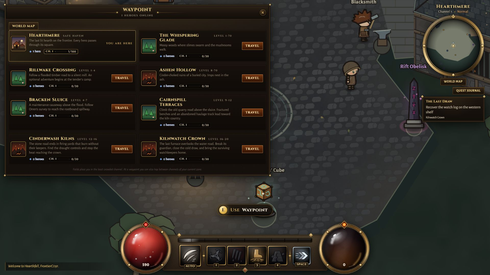
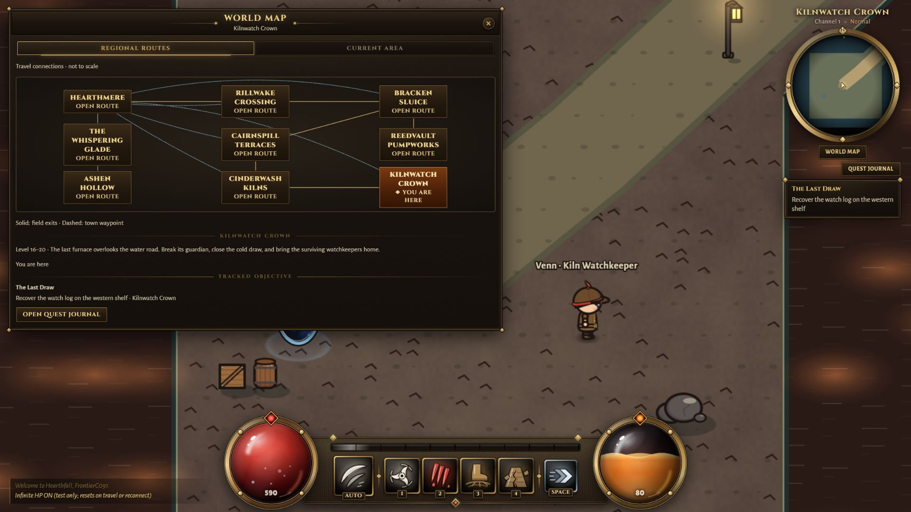
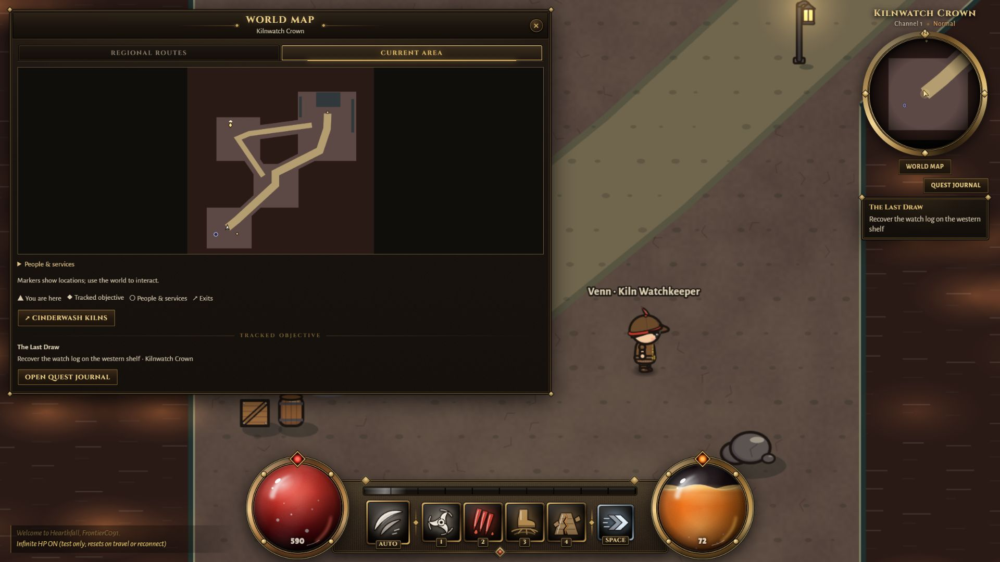
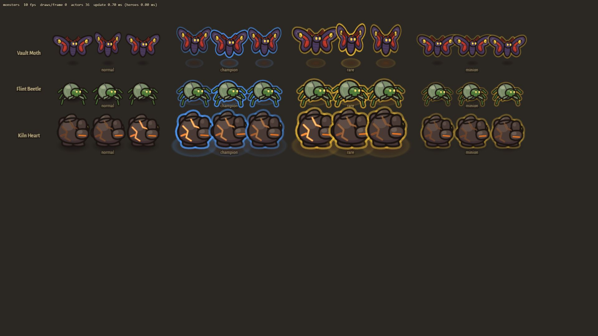
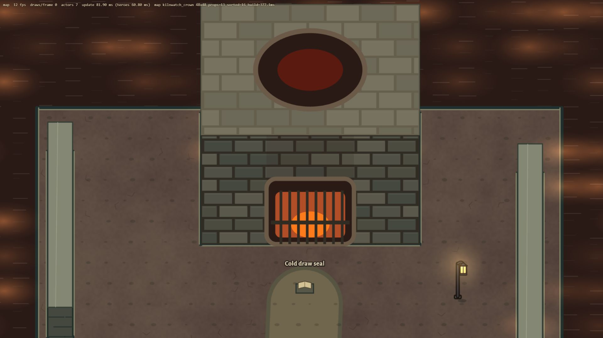

# Early campaign implementation — C091

2026-10-10, solo on codex/new-tristram-town. The P7 content/system inventory is implemented through the1–20 story slice; its human/balance/performance acceptance is not complete. This is not the completed Claude roadmap. Next implementation phase is P8.

## Playable addition and reason

Three connected authored areas extend the water-road story: Cairnspill Terraces, Cinderwash Kilns and Kilnwatch Crown. Each has original polygons, solid props/buildings, physical contacts and clues, encounters, return/onward routes, ambient motion and positional sound. Seven story quests across two chapter groups now lead through six authored destinations. See [content checklist](CONTENT-UNIT-CHECKLIST.md) for measured unit counts and [campaign budget](CAMPAIGN-BUDGET.md) for exact awards.

The owner selected story progression without mandatory repeats. Fixed one-time awards total1,524,432 XP, the existing curve's level1→20 requirement; kills remain additional. Bands are1–4 /4–7 /7–9 /9–12 /12–16 /16–20. Previously claimed rewards remain claimed, without backpay. Previously earned access survives the new band requirements. New reserved weapon rewards use the predicted post-award level; already-reserved items stay unchanged. Older low-level completed saves do not receive the same new-character XP history automatically.

Two original creature families add a locked three-shot moth fan and beetle ground-fracture lines. New authored-only Faulted elites use marked fractures; procedural/rift random trait probabilities remain unchanged. The Last Ember reuses the brute rig/stat budget but alternates fracture lines and projectile rings without loot-bearing adds. Cinderwash introduces the existing fire/explosion roster into this campaign; it is not a claim of a new global family. Existing18-skill kits gain their existing unlocks through these bands, with no additional skill promised here.

Evidence preceded implementation in L108–L111/D049: owner pacing choice; local XP/room/passage/attack budgets; NPS quarry/haulage/kiln workflow; Natural History Museum moth/beetle form references; actual failed cover checks and inspected local screenshots. All names/text/art remain original code, no imported media/dependency. The five-game research register remains188 sources/184 claims: these natural-history/site and local measurements are separately logged in REFERENCES, not counted as new comparative-game claims.

## Corrected and removed behavior

- One Pumpworks east-room Thornling becomes a moth at the same inherited stat budget. No other old placed enemy, zone or quest is deleted.
- Existing authored buildings/solid props/barriers now stop airborne projectiles by exact segment intersection. Open water still permits flight. This corrects the old tile-only cover gap and changes previously erroneous through-wall shots in older authored areas too. Ground movement geometry is unchanged.
- Authored return trips arrive by the reciprocal portal rather than the distant default entry. Server level checks also enforce the existing Ashen minimum previously shown only by UI, with earned quest-route compatibility kept.
- Waypoint uses two columns with up to eight destinations per page, and bounded channel pages. World routes show all nine fixed regional destinations. Same frames/fonts/colors, fixed620/90ms camera, no scrolling menu content. Ashen area maps use ash colors.

Future effect: this is the early-game baseline for P8's currency/drop audit and P9's next bands. No durability, gamble, potion, travel or respec fee is added. No town, hero, legacy procedural layout, save identity, private data or completed quest history is removed.

## Measured verification

16 focused checks pass: seven frontier checks, five affected quest-chapter checks and four Reedclaw checks. Covers all six authored reachability/target validations, all-class reward-only L20 arithmetic/full-bag/replay/reload, physical travel/legacy access/dungeon clamping, fan aim/interruption/cover, thin-wall and grazing-barrier cover, fracture dodge/warnings/cover/cancellation, bounded elite/boss timing and unchanged random affix pool. Each uses isolated temporary DATA_DIR with backups disabled. Early fixture setup mistakes and the real cover gap were corrected; the passing result is after those fixes.

Typecheck, content validation and production build pass. Content:3 classes,18 skills,42 bases,19 legendaries,3 sets,5 gem kinds,18 monsters,10 zones. Final build894 modules; largest client JS1,224.97kB (398.06kB gzip). Existing Vite config-loader/chunk-size warnings remain. No full suite or repeated campaign replay.

On the owner's PC in Chrome1920×1080: actual travel to Crown, infinite HP explicitly enabled, waypoint/region/current-area panels inspected; moth/beetle/boss and kiln render galleries inspected. Corrected ash/map colors, level-label wrapping, gallery clipping and coarse initial masonry. Final game/gallery console error queries returned no errors. Five screenshots are included; galleries are synthetic render fixtures, not combat playthroughs. Each saved PNG is1920×1080. Incidental FPS is not a foreground benchmark.

## Not yet verified or accepted

No all-class full-input campaign completion, human pace/death/drop acceptance, complete on-device boss fight, audible mix assessment, smaller-viewport/error-state tour, sustained foreground/multiplayer benchmark or independent review. Kiln art is still visually simple/block-like and awaits owner style judgment; original code rendering is not proof of final art acceptance. Previously logged G5/R1/G6 remain open. Keep implementation and gate status separate.

Rollback: close new offers/entrances while preserving saved definitions/history and item ownership; restore the one replaced enemy if reverting content. Do not reopen paid quests. Restoring prior XP affects future unclaimed rewards only. Retain the independent cover fix unless its own regression is demonstrated. No new save/protocol version is needed (save8/protocol11).
