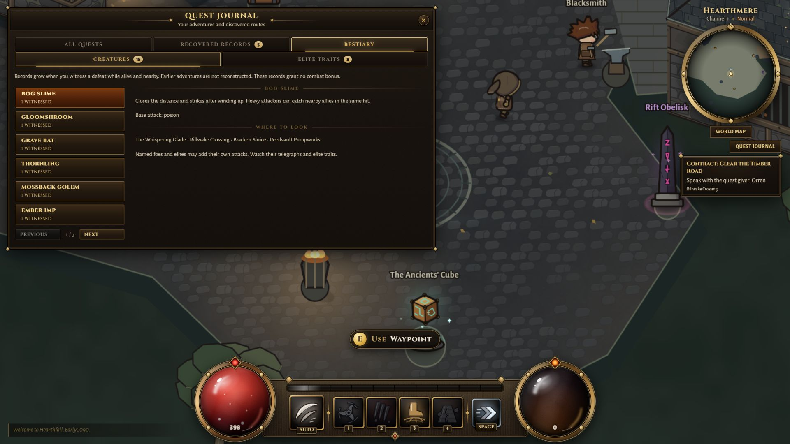
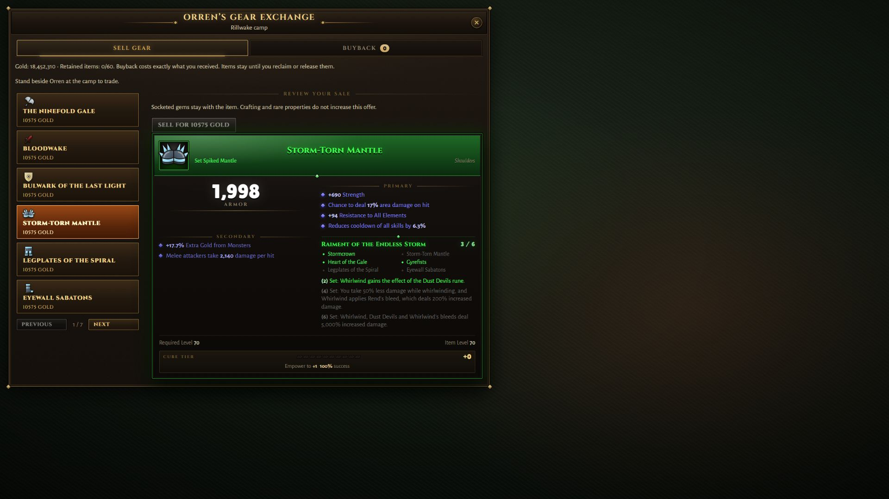

# P7 field-loop implementation — C090

2026-10-10, solo on codex/new-tristram-town. This closes the first contracts, optional field-event runtime, character bestiary data and minimal seller scope. It does not complete the P7 chapter, P8 economy, G6 or the whole roadmap. Continue the remaining chapter checklist in PLAN.md.

## Added and why

Evidence was logged before implementation: L104–L107 and D045–D048 in the town reference/decision logs. The existing five-game dossier remains the comparison basis; the historical D3 optional-event source supports activation, while local authored members, gold formula and inventory capacity supply the actual numbers. No copied assets/text, download or dependency.

- Three repeat contracts at physical Orren: three road slimes for54gold, two bank bats for64gold, one enrolled overlook clear for108gold. Fixed original text, physical accept/claim, saved cycle identity, bounded history and actual post-acceptance events. Existing story quests/rewards remain ahead of optional contracts in the catalogue.
- The Overlook Alarm: explicitly raise/join at the existing survey marker. The same six-member pack is channel-shared; only enrolled living nearby participants at its final actual death receive wave credit. Despawns invalidate completion. Existing18s/out-of-view rules re-arm after the pack clears. Survivors remain ordinary shared enemies when participants leave; there is no bonus chest or unattended completion.
- Bestiary: per-character witnessed defeats, original attack explanations from the actual roster, derived habitats, encountered elite traits. Fifteen current types/eight traits, bounded by content IDs with safe-integer saturation; no stat bonus/reward or fabricated historical backfill. Unknown records/revisions retained. Account collections remain P14.
- Orren buys inventory gear for one expected normal gold pile at item level. Same-price buyback retains exact item IDs/rolls/sockets/binding. Sixty retained slots, matching existing inventory capacity; full means sell refusal, never eviction. Explicit reviewed release gives up an already-sold item and its gems, with no additional gold. Saved sequence, expected price, exact NPC contact, living state, ownership, protection, pending enchant, overflow and full-bag checks reject invalid transactions before mutation.
- Merchant custody is included in stash/delivery/reward/protection/normalization ownership inspection. Save8/protocol11 add optional records; old supported saves preserve their contents. Existing JSON atomic snapshots/receipt infrastructure remains; this is not a new crash-before-ack durability guarantee.
- Journal and exchange use the same frames/fonts/colors, columns, tabs and pages. Full set-item preview uses the available second column. No vertical content scrolling.

## Changed or removed

Only the overlook's automatic pack activation was replaced by explicit marker activation. Its six monsters, ordinary XP/loot, geometry and story survey remain. No old quest, zone, town art, class, ability, item or save was removed. Future impact: initial passive danger/XP access at the overlook changes; players can opt into it, and P8 must include the new fixed contract/sale gold sources in its audit. Deliberate merchant release is the only new permanent item-consumption action and requires a separate selected-item confirmation. It never discards another retained item.

## Measured checks and limits

22 focused checks passed on the owner's PC: six new field-loop checks, nine persistence/foundation checks, five affected quest-chapter checks and two introduction checks. They cover real handler/kill hooks, wrong NPC/remote/dead rejection, stale prices/sequences, full inventories/custody, protection/pending enchant, buyback/reload, no retroactive/repeated reward, explicit event enrollment/cooldown and despawn rejection. Test players use infinite HP. Every run uses a fresh temporary DATA_DIR and disabled backups. Typecheck, content validation and production build pass; existing Vite configuration/chunk warnings remain. No full suite or campaign replay repeated.

Chrome1920×1080 on their PC: inspected the running journal with a clearly synthetic populated character and the existing panel gallery with a full set-item preview. Both captured views fit without a scrollbar. Gallery trade is deliberately disabled outside physical contact; it proves layout, not NPC interaction. A brief camp approach had infinite HP enabled but browser movement input did not reliably advance the character; stopped that walk instead of spending time on another full playthrough. Actual command authority is covered by the focused checks. Owner live merchant/event usability, smaller viewports, complete populated/error states, human pacing/accessibility and foreground performance remain unverified. Displayed incidental FPS is not a benchmark.

## Remaining chapter work

Real authored progression bands and compatible gates; measured1–20 content budget/follow-through; destination-specific behavior novelty; elite-affix expansion/combinations; reusable content-unit checklist and integrated chapter report. P8 still owns vendor stock/buy pricing and complete source/sink decisions. Human playthrough and economy bands stay separate from implementation. Do not stop at this checkpoint.

Rollback: disable new records/UI/contract entry without deleting saved data. Restore automatic overlook activation if reverting the event. If removing the merchant permanently, migrate retained items explicitly before deleting that feature. Do not restore an already-paid quest cycle.
