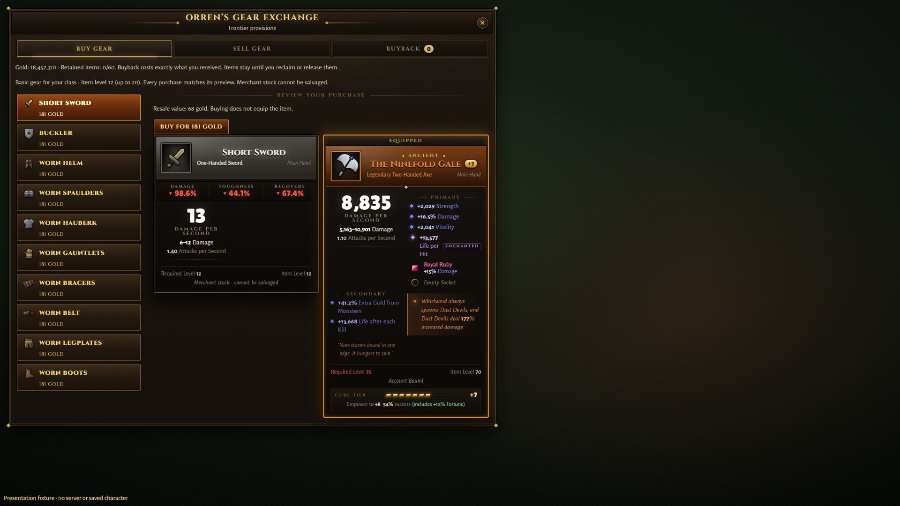

# Camp stock, purchase and provenance — C092

2026-10-10. Completes buy/sell/buyback implementation for the early-game vendor scope, not all P8 or G6. C091 campaign checkpoint is pushed as1e9b590. Solo, no downloads.

## What and why

Owner chose basic purchases that fill weak slots after a few packs. L112/D050 records the prior research: current pack/drop/stat budgets, observed reference preview/accept flows and Blizzard's historical2.0.1 restriction on salvaging vendor-bought gear. Ten fixed normal templates per class (weapon/offhand/eight armor slots), at character level capped20, are sold by physical Orren, Iven, Kessa and Venn. Each reuses existing mean normal stats and original look generation. No random shopping rerolls, new rarity, zero-stat normal jewelry, new currency or town change. Template tokens never become owned IDs; purchased copies receive server UUIDs.

Prices equal ceil(12 *0.22 * current base gold pile), bounded above resale by at least one gold. This is a candidate interpretation of three four-member packs, not a reference-game rate or a promise of elapsed minutes. At levels1/4/7/9/12/16/20:19/47/86/119/181/296/458gold. Existing sale prices and exact retained buyback are unchanged. Purchased stock cannot produce salvage materials/Cube XP; targeted and bulk consumers enforce this, and inventory/Cube/tooltips explain it. Existing found/quest items stay salvageable.

Same-style panel: buy/sell/buyback tabs, ten visible compact stock rows, exact price/resale/provenance, equipped-item comparison, full-bag/funds/stale states and explicit permanent release. Server verifies alive proximity to the selected physical contact, catalogue/class/level/price, saved sequence, funds, free slot and supported custody before mutation. No client-supplied item properties accepted. Save9 adds optional provenance with legacy absence preserved; protocol12 prevents an older UI hiding the new rule. The new v8/v9 synthetic fixtures include retained custody.

## Model, not player pace

[Raw model](STOCK-MODEL.json), reproduced by scripts/audit-vendor-stock.ts:21 level/class cases ×2000 fixed-seed24-kill trials =42,000 trials/1,008,000 actual drop-generator calls. Normal difficulty, no gold-find, fixed level, all generated gold assumed collected. No elite, contract, item-sale or offline income. Pity resets per trial; generated item/gem counts are retained but never credited as gold.

44.2–48.55% can afford one item after12 kills;88.6–91.45% after24. First-affordability medians among the completed trials are12–13kills; the report explicitly counts unfinished trials at24 and does not disguise them as completed. This supports a few-pack starting budget; it does not prove real pickup losses, advancing-level affordability, playtime, inflation or complete source/sink balance. The owner-selected purpose is implemented; P8's broader economy acceptance remains open.

## Focused verification and limits

19 distinct focused tests pass: four new stock/conservation tests, six existing early-field-loop tests and nine foundation tests. After adding v8/v9 fixtures, the nine foundation tests were rerun: all pass. Initial new fixture ID exceeded the existing16-character limit; corrected the synthetic ID, without changing the production limit. Checks cover all three classes/all70 character levels, template stability/legal budgets, unchanged gold RNG arithmetic, every merchant's alive/proximity/forgery/price/funds/full-bag checks, replay after reload,15 additional distinct purchases, resale/buyback gold conservation, equip/stash/provenance retention, both salvage paths and v0–v9 migration preservation.

Typecheck/content validation/build pass. Final largest client JS1,227.61kB (399.10kB gzip); existing Vite config/chunk warnings remain. No full game replay/performance claim. Fresh isolated DATA_DIR and backups disabled for all runtime runs; no real saves accessed.

Real Chrome1920×1080 on the owner's PC: inspected final stock list and comparison against a deliberately overpowered gallery item, with all ten offers and both cards visible and no scrollbar. Gallery is labelled and rejects trading: this proves layout, not a live UI transaction. Console query returned no errors. Captured JPEG is1920×1080. Human transaction feel, smaller/error/populated states and sustained performance remain. My own server was restarted on2567 using a fresh synthetic save/protocol12; Vite remains5173.

## Removal/future/rollback

No existing item/system/content deleted. Only newly purchased stock loses salvage eligibility; this prevents cheap shopping from becoming a crafting-XP/material source. It may still be equipped, improved, stored, sold/reclaimed or explicitly destroyed. Original bound/protected flags persist. Hybrid artisan gates and60-slot per-character stash remain. Restore a prior code version only with save9 support; disabling purchases must preserve purchased gear/provenance/custody, not delete items or refund already-spent gold implicitly.

Remaining P8: complete currency/source/sink/binding/artisan decisions; local economy summaries, durable command boundary, concurrency/soak/inflation evidence and independent human review. Owner handles full playtesting later. Do not call the roadmap finished.
