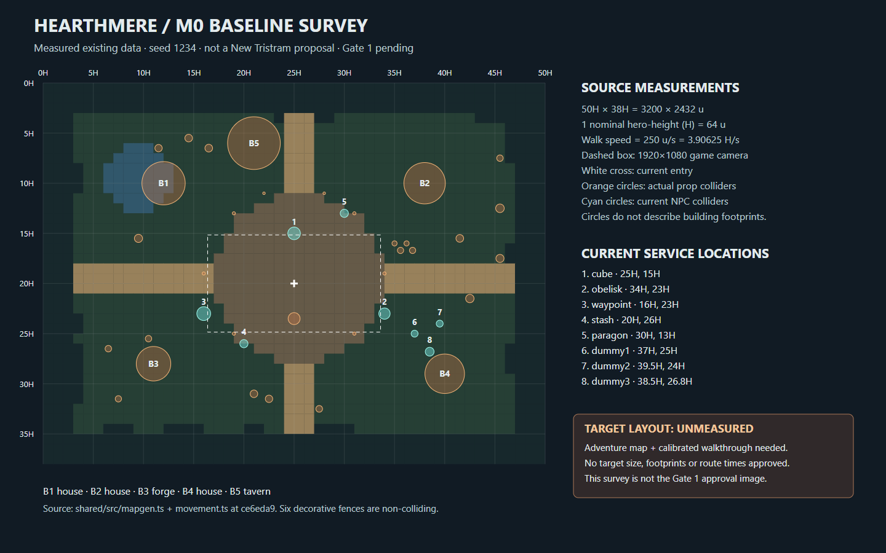

# Hearthmere design — M0 / Gate 1 proposal

Sources and raw measurements were recorded first in [REFERENCES.md](REFERENCES.md), survey S01. This is a proportional reconstruction for review. No runtime town code, art or services have been changed.

## Confirmed scope

PC Adventure Mode, all artisans unlocked; darker/drearier mood subject to Gate 3; original Hearthmere art/names/text/audio and unchanged heroes/UI. Existing operations only, with an explicit exception for a real persistent stash. Inn/Forge interiors optional at M5. Enlargement subject to layout/performance gates. U only near Cube. No subagents. See D002–D005/D009–D012.

## Proposed target — Gate 1 draft

[Editable SVG](target-layout.svg) · [All coordinates and polylines](target-layout.json). This is an original documentation diagram, **not a game screenshot**, final art or a D3 collision survey. S01 was logged before drawing. Solid service markers follow observed Adventure adjacency; hatched building masses and wall alignments are inferred. Cyan additions are Hearthfall-specific. No town code has changed.

The source-image axes are mapped to Hearthfall screen-ground coordinates: `xH = 8 + (px - 450)*0.22`, `yH = 6 + (py - 230)*0.17`, then `u = H*64`. Conservative scale uncertainty is ±25%, not statistical confidence. Source landmarks carry ±2–6 px pick/anchor uncertainty as recorded in REFERENCES S01. Values below define a **reviewable proposal**; numeric precision makes the document reproducible, not exact to D3.

The playable reference envelope is about 76H × 46H. Proposed backing map: **96H × 64H = 6144 × 4096 u**, rounded to 512 u chunks with room for the unchanged 17.22H × 9.69H camera. This is 3.23 times the old rectangular area, not 3.23 times the visible texture load. Keep lazy chunking/culling and prove the new budget later. Exterior silhouettes may occupy the margin; reachable edges require camera clamps and real blockers.

Keep the core service cluster compact. The inn fronts the plaza, workshops line the upper/right edges, and the back lane turns around the inn toward the shrine/upper court. The pier branches off that lane. The southern approach reaches the plaza through the eastern gate; no invented direct southern opening. The right exit is an approach to distant ruins, not a cathedral transplanted into the hub. Decorative healer/house geometry adds no new service mechanics.

### Proposed service coordinates

Coordinates are NPC/object anchors; route endpoints are nearby approach points, not occupied collider centers. Final safe approach positions and interaction radii need M1/M2 validation.

| # | Service | Anchor u | Approach u | Evidence / operation mapping |
|---|---|---|---|---|
| 1 | Waypoint | 2891.5, 2364.2 | 2891.5, 2418.6 | R23/R20; travel; preserve field/rift return behavior |
| 2 | Stash | 2708.5, 2113.9 | 2750.7, 2168.3 | R23/R20/R25; persistent deposit / withdraw (approved exception) |
| 3 | Blacksmith | 3159, 2201 | 3116.8, 2255.4 | R23/R20; salvage, salvageAll, upgrade |
| 4 | Jeweler | 2919.7, 1852.8 | 2947.8, 1896.3 | R23/R20@30; fuseGem, insertGem, removeGem, socket |
| 5 | Mystic | 3243.5, 1689.6 | 3285.8, 1754.9 | R23/R20@33; enchantRoll, enchantPick |
| 6 | Cube | 2933.8, 2592.6 | 2933.8, 2538.2 | R23/R17; transmute, extract, reforge, cubeEquip; U only nearby |
| 7 | Rift Obelisk | 3271.7, 2396.8 | 3201.3, 2451.2 | R23/R17; riftOpen, riftEnter; distinguish physical portal |
| 8 | Paragon shrine (adaptation) | 2455, 1591.7 | 2426.9, 1657 | R23/R17 location + owner adaptation; paragon, paragonReset |
| 9 | Training yard (adaptation) | 2455, 786.6 | 2342.4, 862.7 | R23/R24 upper court + owner requirement; three existing server dummies; unchanged combat/progression |

### Provisional structure schedule

Every polygon below is original proposed massing fitted to documented frontage/road evidence, **not a measured reference footprint**. `target-layout.json` contains full world-unit vertices, door candidates and baseline candidates. Heights are visual classes with broad ranges. Final collision pieces, door widths, exact baselines, lamp radii and emitter counts must be authored and verified in the blockout/look milestones. Gates/fences are separately noted below; no decorative solid may ship without a collider.

| ID / structure | Proposed footprint polygon u | Height / access | Source / intended ambience |
|---|---|---|---|
| inn — Inn | (2187.5,1950.7) (2469.1,1700.5) (2722.6,1918.1) (2624,2059.5) (2441,2168.3) (2272,2103) | 3–5H; M5 optional | R13/R16/R20/R25; warm windows; door lamp; chimney smoke; sign sway |
| forge — Forge | (3299.8,2026.9) (3581.4,1994.2) (3806.7,2201) (3623.7,2385.9) (3271.7,2266.2) | 2–4H; M5 optional | R13/R20; forge fire; smoke; sparks; hammer |
| jewel-stall — Jeweler stall | (2722.6,1657) (2947.8,1548.2) (3074.6,1722.2) (2863.4,1809.3) | 1–2H; open apron | R20@30; lamp; cloth; gem action |
| mystic-wagon — Mystic wagon | (3088.6,1559) (3257.6,1428.5) (3454.7,1569.9) (3299.8,1678.7) | 1–2H; open apron | R20@33; lamp; cloth; subtle original magic |
| lane-house — Lane house | (3806.7,1559) (3975.7,1439.4) (4144.6,1591.7) (4060.2,1754.9) (3820.8,1776.6) | 2–3H; exterior | R15/R20@39; one porch lamp; no new healing mechanic |
| back-house — Back-lane house | (1722.9,1787.5) (1905.9,1624.3) (2089,1765.8) (1976.3,1961.6) (1779.2,2016) | 2–3H; exterior | R13/R24-05; door lantern; window glow |
| court-house-a — Upper court house A | (1624.3,743) (1807.4,623.4) (1962.2,753.9) (1835.5,949.8) (1652.5,928) | 2–3H; exterior | R24-07/08; window lamp; foliage |
| court-house-b — Upper court house B | (2483.2,373.1) (2736.6,297) (2933.8,449.3) (2793,579.8) (2567.7,558.1) | 2–3H; exterior | R24-08; cellar ramp frontage; window lamp |
| cellar — Closed cellar apron | (2624,590.7) (2750.7,612.5) (2666.2,688.6) (2539.5,656) | <1H; closed exterior | R24-08; solid ramp; no dungeon added |

Additional layout elements: stone-and-timber eastern gate and upper gate (R24-01/07), wall separating plaza from southern approach (R13/R23), fenced healer lane (R15/R20), pier/deck (R24-09), waypoint platform (R20/R25), chest at inn (R20/R25), Cube and Rift pads (R17/R23), adapted Paragon clearing and three-dummy court. Their centerlines/anchors are in the JSON; exact solids and tall-part baselines remain M1 work. Do not interpret the cartographic road stroke as an exact navigable polygon. More exterior roof survey is needed before turning all surrounding negative space into houses. No hidden building count is asserted.

### Calculated route schedule — not measured in-game walking times

Polyline lengths use the proposed transform and nearby approach points. Seconds = length u / 250; walking ignores acceleration/collision detours, current proximity radii and interactions. Scale sensitivity alone is roughly ±25%; route endpoint and unmodeled obstacle errors are additional. Paths have not been collision-tested and are not acceptance results. Verify/revise every row by walking the M2 blockout. The reference video has unknown movement bonuses and pauses, so it cannot establish exact D3 travel times or prove the earlier “all vendors <30 s” claim.

| Route | H | u | Nominal seconds |
|---|---:|---:|---:|
| WP → Stash | 4.51 | 288.7 | 1.16 |
| WP → Blacksmith | 4.40 | 281.5 | 1.13 |
| WP → Jeweler | 8.22 | 525.9 | 2.10 |
| WP → Mystic | 12.17 | 779.2 | 3.12 |
| WP → Cube | 1.98 | 126.9 | 0.51 |
| WP → Rift | 4.87 | 311.5 | 1.25 |
| WP → Paragon | 22.18 | 1419.4 | 5.68 |
| WP → Training | 40.44 | 2588.3 | 10.35 |
| WP → Inn | 5.56 | 355.6 | 1.42 |
| Stash → Jeweler | 5.28 | 337.9 | 1.35 |
| Jeweler → Mystic | 5.76 | 368.6 | 1.47 |
| Mystic → Blacksmith | 8.58 | 548.9 | 2.19 |
| Blacksmith → Stash | 6.08 | 389.4 | 1.56 |
| Cube → Rift | 4.40 | 281.3 | 1.13 |
| WP → Pier | 49.55 | 3171.3 | 12.69 |
| WP → Upper gate | 41.82 | 2676.3 | 10.71 |
| WP → Eastern gate | 25.51 | 1632.5 | 6.53 |
| WP → Southern approach | 68.76 | 4400.9 | 17.60 |
| WP → Ruins-road exit | 55.80 | 3571.1 | 14.28 |

### Open questions / gate scope

- **Gate 1:** approve or revise this proportional layout, including the ±25% scale range and the two marked Hearthfall adaptations. This approval is still required; blanket research approval did not approve an unseen diagram.
- Persistent stash is approved in principle. Before M2: propose character-bound versus shared storage, capacity and migration/duplication rules; no account-sharing assumption is made now.
- Exact building rear walls, doorways, heights, occlusion splits, art pipeline and light/sound tuning remain later proof points. Mood and existing-operation scope are already answered; do not ask again.
- Final foreground/multiplayer performance, fully warmed texture residency and audio listening remain unverified where noted in PERF/REFERENCES. A gallery proxy is not a networked town test.

**Stop after presenting Gate 1.** No M1 schema/collision/runtime implementation before the owner reviews the diagram.

## Service authority requirements retained from the baseline audit

All service commands must validate the player is in the correct town, at the matching physical service, for every operation. Preserve existing Cube levels/XP. Verify far-away rejection, wrong-NPC rejection, moving away while a panel remains open, and both enchanting phases. Gem insertion/removal and passive Cube equip must not evade checks. The current server lacks these location checks; the stash currently just aliases inventory.

Do not blanket-lock inventory/equip/skills/channel changes or return-to-town actions. Preserve existing field/rift return semantics. Rift service opening and entry into its actual generated portal need distinct nearby-object policies. New stash migration/item-identity/logout tests belong to M2. Capacity and character/account scope are still open; no new vendor/repair/transmog/gambling/quest economy is approved.

## Current-town measured diagram

Editable diagram: [baseline-layout.svg](baseline-layout.svg). Exact extraction: [checks/baseline-geometry.json](checks/baseline-geometry.json). Source L01/L02; seed 1234 at ce6eda9. One nominal hero-height H = 64 world units (u). Map = 50H by 38H = 3200 by 2432 u. Current entry = (25H,20H). Nominal movement is 250 u/s = 3.90625 H/s. Camera at 1920x1080: 620 u tall, approximately 1102.22 u wide, nominal 64 u hero projects to 111.48 pixels tall before animation/gear. These are game-source conversions, NOT measured D3 scale.

The diagram depicts actual tile classifications and circle colliders, not visual building footprints. Orange circles use r*s, as CollisionWorld does. A center coordinate is not a doorway. Existing boundaries/decoration depend on seed; fixed landmarks do not.

| Baseline ID | Kind | Center u | Actual collider radius u | Polygon / doors | Depth data | Enterable / lights / emitters |
|---|---|---|---:|---|---|---|
| B1 | house | 768,640 | 138 | None authored | single prop y | No authored interior or light/emitter records |
| B2 | house | 2432,640 | 132 | None authored | single prop y | Same |
| B3 | forge | 704,1792 | 110 | None authored | single prop y | Same; existing renderer may attach kind-based FX |
| B4 | house | 2560,1856 | 126 | None authored | single prop y | Same |
| B5 | tavern | 1344,384 | 168 | None authored | single prop y | Same |

The six existing fence props have r=0. Exact polygons, baseline polylines and door openings are missing in current map data. These source findings explain why a renderer-only art replacement cannot satisfy the mission.

## Current service measurements (not walking-route verification)

Coordinates come directly from generateMap. Distance is straight center-to-center from the current waypoint; seconds are that distance divided by 250. Centers are occupied by colliders, so these are geometric comparisons, not reachable endpoints, measured walking times, nor a claim that a route is unobstructed. A real route must start/end at free interaction positions and follow collision-valid paths.

| Current spot | x,y u | x,y H | Geometric distance u | Distance / 250 s |
|---|---|---|---:|---:|
| Cube | 1600,960 | 25,15 | 770.66 | 3.083 |
| Obelisk | 2176,1472 | 34,23 | 1152.00 | 4.608 |
| Waypoint | 1024,1472 | 16,23 | 0 | 0 |
| Stash | 1280,1664 | 20,26 | 320.00 | 1.280 |
| Paragon | 1920,832 | 30,13 | 1101.10 | 4.404 |
| Dummy 1 | 2368,1600 | 37,25 | 1350.08 | 5.400 |
| Dummy 2 | 2528,1536 | 39.5,24 | 1505.36 | 6.021 |
| Dummy 3 | 2464,1715.2 | 38.5,26.8 | 1460.39 | 5.842 |
