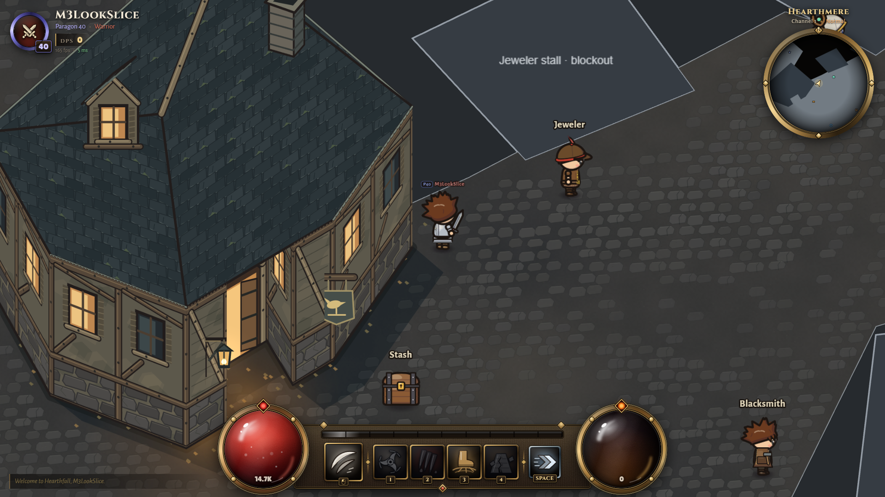
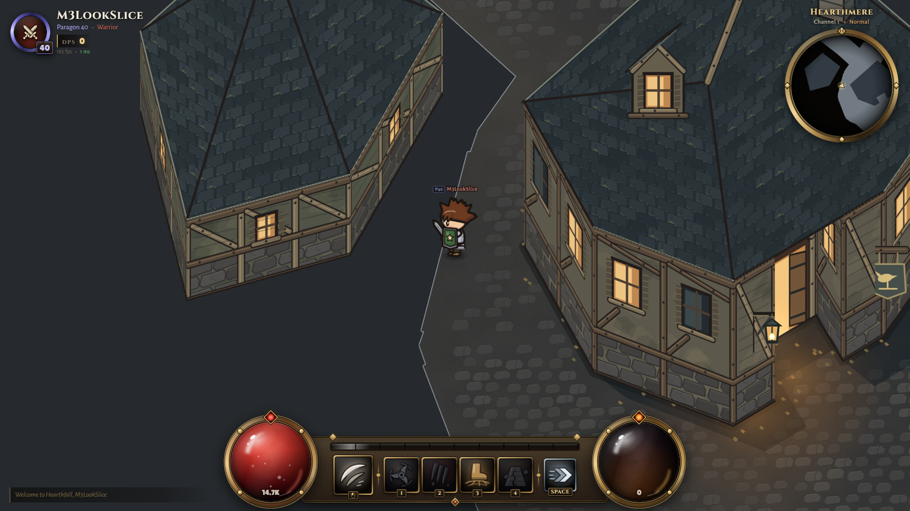

# M3 look slice — Gate 3, first review

Gate 2 was approved by “start the look slice!!”. This checkpoint presents the original material/architecture direction before applying it to the whole town. Full M3 is not complete; stop for the owner's slice approval.

## In the running game

Original timber-and-stone inn with slate shingles, dormer, chimney, recessed entrance and wren sign; a lower back-lane shack; worn plaza paving and soil margins; warm entrance light and a flickering hanging lamp. The smith uses the existing hero rig with original work clothes, apron and pocket mallet. Hero assets, controls, combat, UI and service rules are unchanged.

Reload http://localhost:2577/?autostart=M2Walkthrough&class=warrior&look=slice to load the new client from the existing isolated review server. From the waypoint walk up-left past Stash to the lit entrance. Continue left around the inn for the shack and rear roof. E opens physical services; F3 shows collision and depth baselines.

## Evidence and implementation

- R20/R24/R25 and measured color relationships S02 precede decision D020. The darker mood was approved. Elevations and details are original interpretations, not a survey of unseen D3 architecture. No downloads or third-party assets.
- Authored JSON holds the two building looks, roof meshes/elevations, baselines, chimney/dormer, slice bounds, NPC look and three light anchors. Code creates original material marks. Unfinished buildings remain labelled blockout.
- Separate wall/roof texture strips sort against baseline polylines. The recess rear wall and front jambs have separate depth. Multiple characters can sort on different sides; ordering does not depend on the local player. Painted wall ground contacts use collision footprint edges directly, with a 2.5 u outline (below the 8 u allowance). This is a construction bound plus inspected overlay, not town-wide final silhouette certification.
- Gameplay geometry hashes identically to town-m2: floors, footprints, doors, colliders, NPC locations/radii/approaches, routes and portals. See checks/m3-slice-geometry.json. Baselines and cosmetic metadata are the intentional changes.

## Measured checks

Typecheck/build pass. Shared tests **10/10**, services **4/4**, simulation **382/382**, town validation passes. Network bots **731 passes / 2 known Windows SIGTERM failures**, 88.3 s. No assertion removed. Logs: checks/m3-slice-*.txt. Every test used isolated saves.

Installed Chrome 154 headless=new, 1920×1080, DPR 1, hidden=false. Normal predicted movement inputs, no teleport/dash, to nine viewpoints. Ten captures include the collision overlay; an additional capture verifies map reentry. Inspected: hero stays in front of the doorway's rear wall, is hidden by the roof from the rear lane, and retains correct contact at the sides. Terrain west/south of the shack is not walkable in the approved map: captures use reachable streets, not a fabricated full perimeter patrol. Full-town corner verification remains part of the full art pass.

Lifecycle: **33 owned town texture sources, 506 depth strips; 94,903,776 bytes (90.5 MiB)** base RGBA pixels, **122,865,803 bytes (117.2 MiB)** estimated with requested ground mip chains. This is source allocation, not GPU residency or whole-game memory. All owned sources report destroyed on leaving town, and the slice rebuilds after returning. The eager ground cache must become a bounded lazy cache before full-town expansion. HUD instant FPS and concurrent test timings are not benchmarks; no 100-player performance claim.

## Inspection corrections and limits

Fixed ground holes caused by opposite polygon winding; collision was unaffected. Softened cobble outlines, replaced the repeated grid appearance with continuous soil/wear fields, darkened plaster and added a dormer to break the roof plane. The first shack camera target was outside reachable ground; final coordinates are recorded in m3-slice-browser.json.

Remaining visual limits: blockout terrain edges and sharp slice boundary, empty surrounding terrain, other buildings still flat, regular shingle courses, hard-edged cast shadows, existing service-object art/size mismatches, nameplates visible behind roofs. Local baked light pools and lamp flicker are not the cohesive M4 lighting system. Smith idle uses the existing rig; hammering, smoke, fog, villagers and positional sound remain M4. Interiors/roof fading remain optional M5. The inn roof deliberately hides the hero on the rear lane.

**Owner decision:** approve the architecture/material/color direction, or request changes. Stop at HANDOFF §8 Gate 3 slice approval before expanding the art pass.
