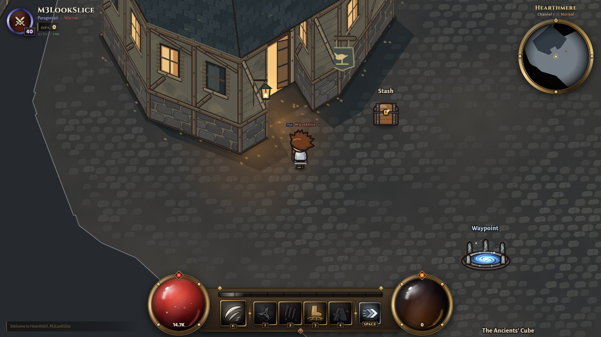

# Hearthmere — Gate 3 look-slice review

**Gate 2 approved; the first M3 look slice awaits Gate 3 approval.** See [the look-slice report and running-game screenshots](M3-SLICE.md). M0 is tagged town-m0 (25b0446), M1 town-m1 (127b5d5), M2 town-m2 (28feac0). The 60-slot per-character stash exception is approved.

- [Playable blockout report](M2.md): working services, test results, browser timings, screenshots and known limits.
- [M1 collision/data report](M1.md): implementation and regression evidence.
- [Design and approved M0 diagram](DESIGN.md) / [layout image](target-layout.png). Runtime source is shared/src/data/town/hearthmere.json; M0 data remains the review record.
- [References](REFERENCES.md), [decisions](DECISIONS.md), [licences](LICENSES.md), [performance baseline](PERF.md).

The inn, one shack, nearby ground, lamp and smith are the first original art slice; other structures remain labelled blockout. Full town art, lighting, ambient life/sound and the 100-player performance gate remain ahead. No proprietary reference image or third-party asset ships.

Move WASD/arrows; E interacts; U works beside Cube; I opens bag; F3 toggles collision. Reload http://localhost:2577/?autostart=M2Walkthrough&class=warrior&look=slice while the isolated review server is running. Walk up-left from the waypoint to the inn. Stop at Gate 3 slice approval before the full art pass.
