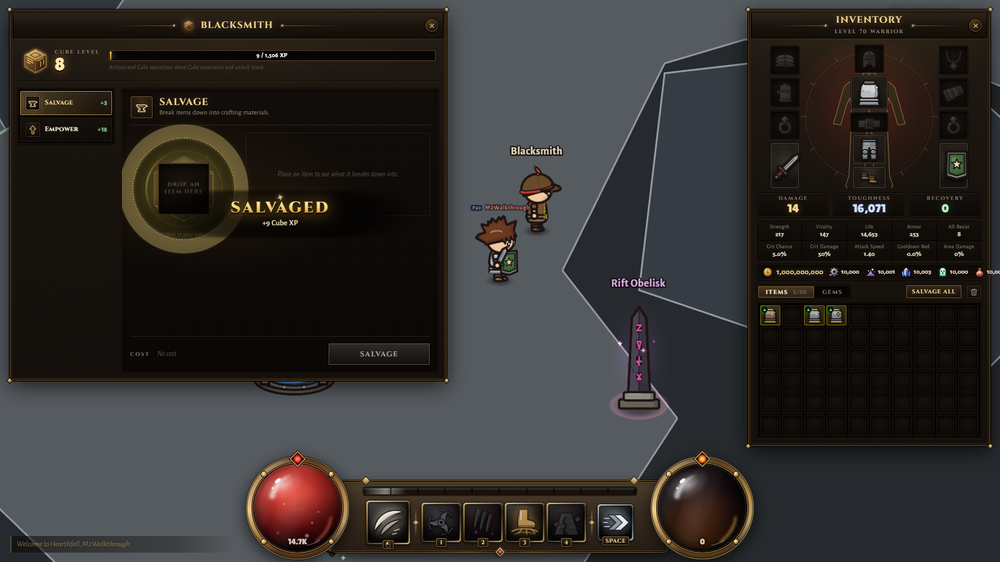

# Hearthmere — Gate 2 review

**M1/M2 are implemented. Gate 2 awaits the owner's playable walkthrough.** Gate 1 was approved in this chat; M0 is tagged town-m0 (25b0446), M1 town-m1 (127b5d5). The 60-slot per-character stash exception is approved.

- [Playable blockout report](M2.md): working services, test results, browser timings, screenshots and known limits.
- [M1 collision/data report](M1.md): implementation and regression evidence.
- [Design and approved M0 diagram](DESIGN.md) / [layout image](target-layout.png). Runtime source is shared/src/data/town/hearthmere.json; M0 data remains the review record.
- [References](REFERENCES.md), [decisions](DECISIONS.md), [licences](LICENSES.md), [performance baseline](PERF.md).

This is a flat-colour gameplay blockout. Final art, occlusion, lighting, ambient life/sound and the 100-player performance gate remain ahead. No proprietary reference image or third-party asset ships.

Move WASD/arrows; E interacts; U works beside Cube; I opens bag; F3 toggles collision. Use the isolated review server at http://localhost:2577/?autostart=M2Walkthrough&class=warrior while it is running. See M2.md for the walkthrough and scope. Stop after this gate for owner approval.
