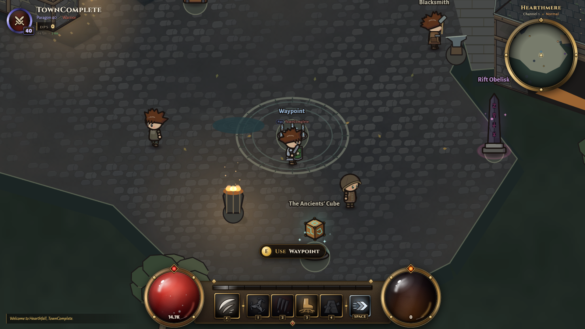

# Hearthmere — authored town

**Paused at the owner's request, 2026-10-08.** Work is saved as an implementation checkpoint. [Resume notes and remaining checks](PAUSED.md). Final acceptance is pending.

The approved look is extended across the town, with working physical services, shared collision, lighting, life, positional sound and enterable Inn/Forge rooms. The owner's instruction to finish all remaining work superseded the intermediate gate pauses (D021).

- [Implementation report, checks and known limits](FINAL.md)
- [Performance measurements](PERF.md)
- [1080p capture index (intermediate builds)](TOUR.md)
- [Approved layout and scale survey](DESIGN.md), [diagram](target-layout.png)
- [References](REFERENCES.md), [decisions](DECISIONS.md), [licences](LICENSES.md)
- Historical checkpoints: [M1](M1.md), [M2](M2.md), [look slice](M3-SLICE.md)

Move with WASD/arrows. E opens the nearby service; I opens the bag. U works only beside the Cube. F3 shows collision. Walk through the inn entrance or forge porch to reveal the interior. The upper court contains the training dummies; the eastern road leads to the fields.

Runtime source: `shared/src/data/town/hearthmere.json`. Run `npm run town:check` after editing it, then restart the server and rebuild/reload the client together. Building footprints, door/interior floor polygons and depth baselines are distinct fields. A visual change must preserve their agreement. Lights, sound emitters, props, patrol paths and minimap geometry are authored in this same file. No Tiled installation is required.

Use an isolated DATA_DIR for every test or review session. Do not reuse an old review server after changing shared geometry: the server and rebuilt client must load the same data. Normal development ports remain 5173/2567; automated capture/benchmark scripts reserve 2578 and refuse to take an occupied port.
