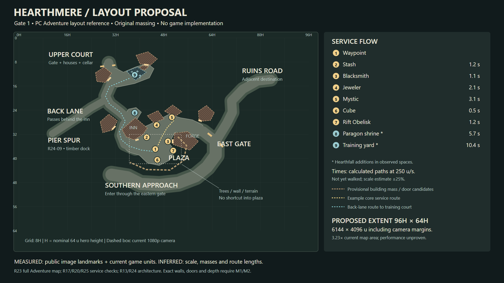

# Hearthmere M0 — Gate 1 review checkpoint

**A concrete layout proposal is ready for review. No M1/game changes; Gate 1 still pending.** Blanket research/download approval has been applied, while the named layout/playable/look/services/final gates remain in place.

- [Design](DESIGN.md): proportional target diagram, nine service anchors, nine provisional structure masses, 19 calculated routes, exact current-map baseline and open questions. [Editable SVG](target-layout.svg) / [coordinate data](target-layout.json).
- [References](REFERENCES.md): 25 external sources/leads, four tool references and five local sources. S01 records inspected map pixels, camera/hero scale estimates and uncertainty before design. Some historical/inaccessible leads are explicitly excluded.
- [Decisions](DECISIONS.md): owner choices plus D009 public-reference method, D010 download approval, D011 proportional calibration, D012 road topology/adaptations, D013 proposed performance budget.
- [Performance](PERF.md): check suite, actual-game/gallery captures and 61-second fixed-seed baseline; measured results separated from estimates and remaining gaps.
- [Licences](LICENSES.md): individual research-use status and [download hashes/sizes](checks/reference-downloads.json). External media stays ignored; no third-party game assets or new tools installed.

## What the proposal establishes

PC Adventure service adjacency and major road topology are observed across public maps and gameplay stills. Derived screen-ground scale is **0.22H/map pixel horizontally, 0.17 vertically, with conservative ±25% uncertainty**. Map proposal: 96H × 64H (6144 × 4096 u), including camera margins. The inn/plaza/workshops remain a compact cluster; the back lane, upper court, pier spur, eastern gate and southern approach remain distinct. Paragon/shrine and training/court mappings are explicitly Hearthfall adaptations.

Footprints, height classes, door candidates and route seconds are **proposed/inferred**, not exact D3 mesh or stopwatch results. Collision, occlusion, full original art and NPC service authority are future M1–M4 implementation. The diagram is documentation, not a running-game screenshot. Baseline screenshots in tour/ show the unchanged game.

## Baseline facts and limits

Typecheck/shared tests/build pass; server **614 pass + two known Windows SIGTERM failures**; simulation **382/382**. Fixed-seed headless Chrome, 100 total heroes + eight NPCs: **64.78 fps average / 41.49 p1**, 60.9942 seconds, hidden=false throughout. Managed texture dimensions imply **479.97 MiB including declared mips**, not actual VRAM. Texture count stabilized at ~11.2 s page time; <5 s fully warmed loading is not proved. Foreground/networked 100-client performance remains unverified. Runtime source is unchanged, so the existing full check results still apply.

## Confirmed owner answers and remaining gate

Public references suffice for a bounded proposal; the owner does not own D3 and is not expected to supply footage. PC Adventure Mode, darker mood, existing operations except a persistent stash, optional Inn/Forge interiors, enlargement subject to performance, U near Cube only, and this chat only are settled. Tiled 1.12.2's named 23,425,024-byte download remains deferred until after Gate 1.

**Owner review needed under HANDOFF §8:** accept/revise the diagram, its scale range and the two marked adaptations. The stash's capacity/character-versus-account policy can be resolved before M2. No town-m0 tag or M1 work until the review checkpoint and its limitations are accepted.
